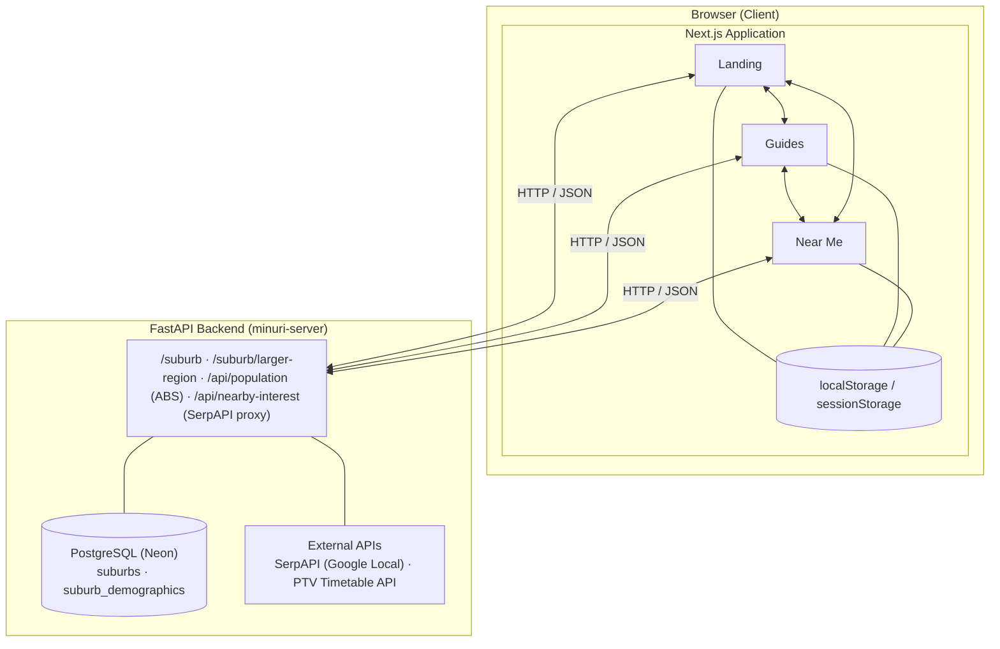
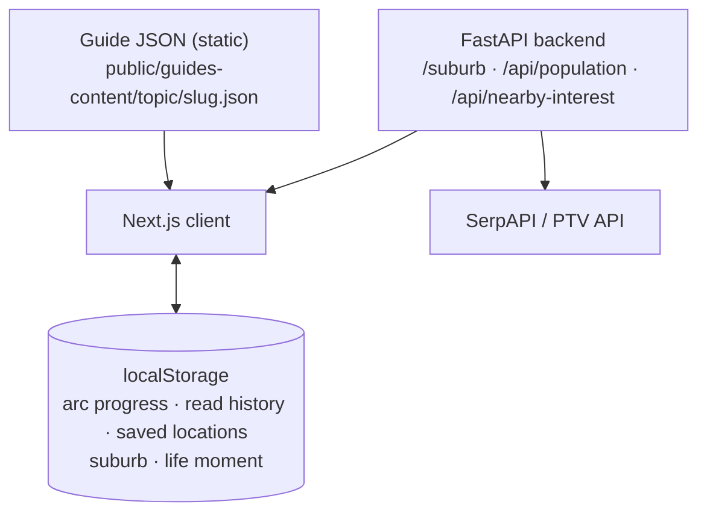
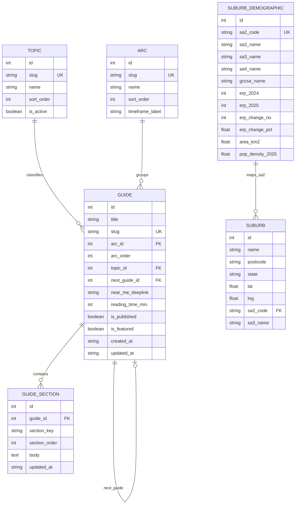
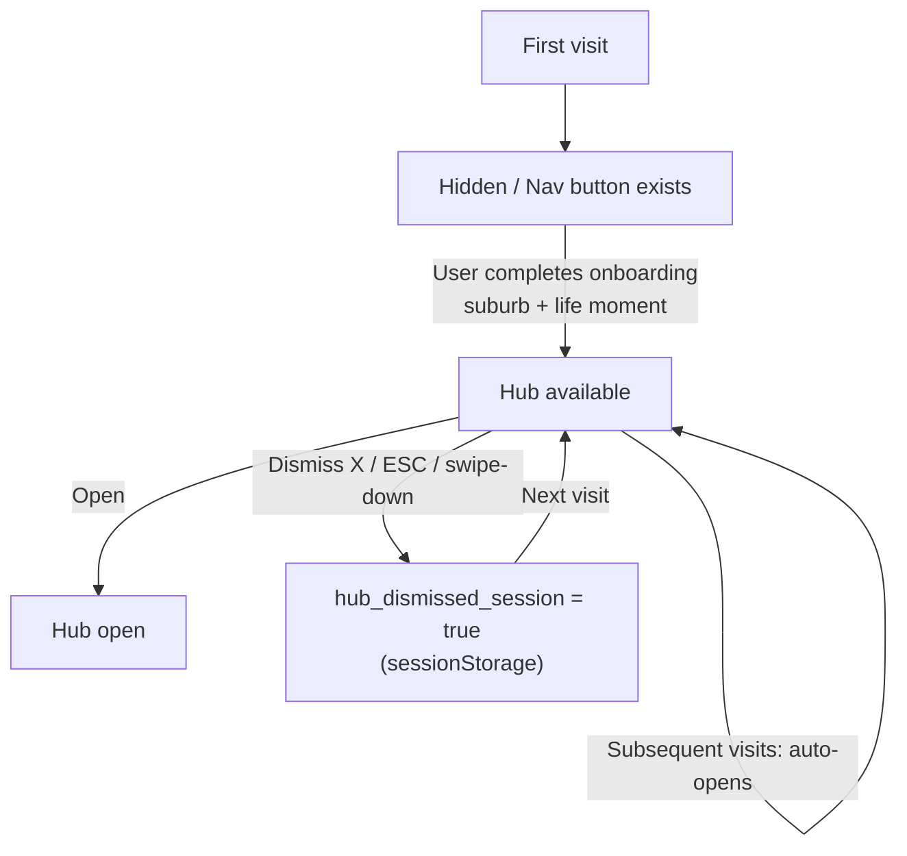
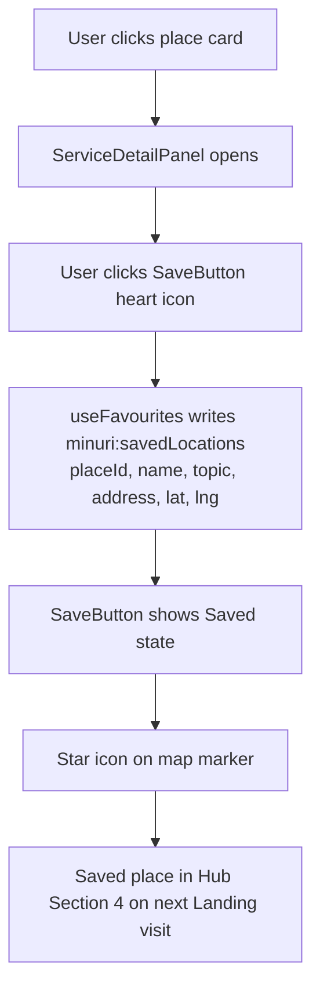
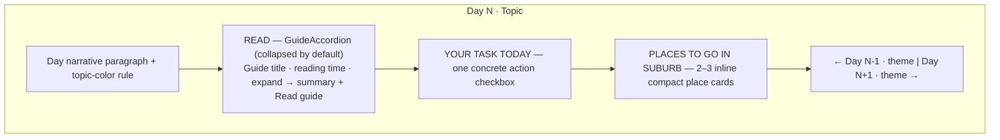
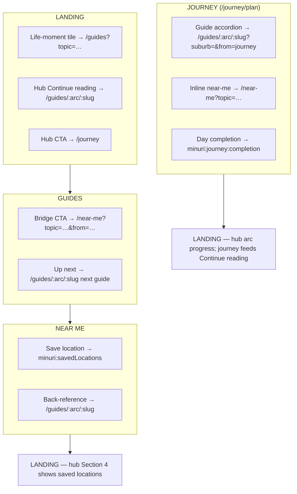

# Minuri — Iteration 2 Analysis and Design Document

**Unit:** FIT5120 Industry Experience Studio  
**Team:** TP39  
**Version:** 1.0  
**Date:** 2026-05-04  
**Author:** TP39 Team

---

## Table of Contents

1. [Executive Summary](#1-executive-summary)
2. [Problem Analysis](#2-problem-analysis)
3. [Requirements](#3-requirements)
4. [System Architecture](#4-system-architecture)
5. [Data Design](#5-data-design)
6. [User Interface Design](#6-user-interface-design)
7. [Component Design](#7-component-design)
8. [Epic 1 — Landing: Detailed Design](#8-epic-1--landing-detailed-design)
9. [Epic 2 — Guides: Detailed Design](#9-epic-2--guides-detailed-design)
10. [Epic 3 — Near Me: Detailed Design](#10-epic-3--near-me-detailed-design)
11. [Epic 4 — Journey: Detailed Design](#11-epic-4--journey-detailed-design)
12. [Cross-Epic Integration Design](#12-cross-epic-integration-design)
13. [Implementation Plan](#13-implementation-plan)
14. [Risk Analysis](#14-risk-analysis)
15. [Evaluation Criteria](#15-evaluation-criteria)

---

## 1. Executive Summary

### 1.1 Product Background

Minuri is a web application designed to help young adults settle into independent life in Melbourne. It provides four interconnected features — a personalised Landing experience, a narrative First-Time Guides library, a Near Me location discovery tool, and a personalised Journey plan — unified around five shared content topics: Food & Eating, Getting Around, Health & Wellbeing, Home & Admin, and Social & Belonging.

Iteration 1 delivered a functional baseline: a landing page, 15 flat guide articles, and a category-filtered Near Me map. However, mentor evaluation identified that the features operated as isolated tools rather than a connected product. The guides felt like a FAQ database. The categories misaligned between Guides and Near Me. The landing page served one audience (new visitors) but not the other (returning users).

### 1.2 Iteration 2 Objective

Iteration 2 transforms Minuri from three features behind a landing page into a single, coherent product with four epics. The core shift is from *reference library* to *accompanied journey*: a user should feel the product is walking with them, not that they are looking up answers.

This document sets out the full analysis and design for the changes across all four epics.

### 1.3 Scope of Change

| Epic | Iteration 1 State | Iteration 2 Target |
|------|-------------------|-------------------|
| Landing | Static marketing page; new-user only | Two-layer experience: marketing + personalised "Your Wellnest" sidebar hub |
| Guides | 15 flat articles in 5 categories | 20+ narrative guides in 3 time-based arcs; unified 5-topic taxonomy |
| Near Me | 7-category tab strip; stub data; standalone tool | 5-topic tab strip (matching Guides); real API data; service detail panel; Guide integration |
| Journey | Static 7-day plan; topic reordering only; sessionStorage state | Deliberate week arc; inline Near Me per day; one guide + one task structure; localStorage persistence; keyword-driven personalisation |

---

## 2. Problem Analysis

### 2.1 Mentor Feedback from Iteration 1

Post-iteration review identified three structural problems:

**Problem 1 — The Guides are informational, not experiential.**
Guides opened with numbered tip lists. A reader skimming the guide could absorb it passively. There was no moment that made them feel *seen*, and no emotional hook that motivated action. The consequence: low engagement and no bridge to Near Me.

**Problem 2 — The two features speak different category languages.**
Guides used five broad topics (`Eating & Cooking`, `Getting Around`, `Health & Wellbeing`, `Adulting Basics`, `Social & Mental Health`). Near Me used seven fine-grained tabs (`Health`, `Mental Health`, `Food`, `Social`, `Groceries`, `Parks`, `Amenities`). A guide on finding a GP deep-linked to Near Me but had no single tab to land on consistently. The two features felt like tools from different products.

**Problem 3 — The landing page had one audience, not two.**
The Iteration 1 landing page was a marketing page for first-time visitors. Returning users saw the same hero section and CTAs every visit. There was no memory of their prior activity, no continuity, and no reason to return. The product treated every visit as a first visit.

### 2.2 Root Cause Analysis

| Symptom | Root Cause |
|---------|------------|
| Guides feel like a database | No narrative template enforced; writers defaulted to tip-list format |
| Deep-links between features are lossy | Category taxonomy defined independently per epic, not as a shared contract |
| No returning-user experience | No localStorage-backed state model; no component designed for return visits |
| Near Me is a standalone tool | No URL parameter contract for incoming links; no "came from a guide" context |

### 2.3 Design Principles for Iteration 2

The following principles govern every design decision in this document.

**P1 — One action per screen.** Every screen answers one question with one action. Landing asks "what moment are you in?" Guides ask "what happens next in this story?" Near Me asks "which of these do you want to save?" If a screen has two answers, it has two jobs — split it.

**P2 — Moment first, facts second.** Emotional recognition precedes practical information. A guide that opens with a specific, recognisable moment ("You wake up at 6am with a 39° fever…") creates a door the reader walks through. A guide that opens with a numbered list slams it shut.

**P3 — Local-first personalisation.** All user state (read history, arc progress, suburb, saved locations) is stored in `localStorage` on the user's device. No login, no server-side session. Privacy framing is explicit in the UI: "Your journey stays on this device."

**P4 — Every screen bridges to the next.** No guide ends in a summary. Every guide ends with a Bridge CTA to Near Me and a teaser for the next guide. No landing page state is a dead end. The product never dead-ends.

**P5 — One taxonomy, shared across all epics.** The five topics are the contract between Guides, Near Me, and Landing. Every routing decision, every deep-link, and every filter chip uses the same five slugs.

---

## 3. Requirements

### 3.1 Functional Requirements

#### Epic 1 — Landing

| ID | Requirement | Priority |
|----|------------|----------|
| FR-L1 | The landing page shall display the tagline "Still feeling home, wherever you are." and a one-line product summary visible on first load | Must |
| FR-L2 | The landing page shall display three life-moment entry points ("I just arrived", "I'm getting set up", "I'm looking for my people"), each routing to a corresponding guide arc and Near Me topic | Must |
| FR-L3 | A "Your Wellnest" sidebar hub shall be accessible at all times via a persistent nav trigger | Must |
| FR-L4 | The sidebar hub shall display a personalised greeting derived from localStorage signals (suburb, arc progress, topic frequency) | Must |
| FR-L5 | The sidebar hub shall display a single "Continue reading" guide card showing the next unread guide in the user's active arc | Must |
| FR-L6 | The sidebar hub shall display arc progress as a three-stage indicator (Week 1, Month 1, Month 3) | Must |
| FR-L7 | The sidebar hub shall surface up to three saved Near Me locations from localStorage | Should |
| FR-L8 | The sidebar hub shall auto-open on return visits and respect a per-session dismiss preference | Should |
| FR-L9 | A live Melbourne population statistic shall be shown on the landing page, sourced from the existing ABS data pipeline | Should |
| FR-L10 | The sidebar hub shall provide export and clear controls for journey data | Could |

#### Epic 2 — Guides

| ID | Requirement | Priority |
|----|------------|----------|
| FR-G1 | Guides shall be organised into three time-based arcs: Week 1 (survival), Month 1 (admin), Month 3 (belonging) | Must |
| FR-G2 | Every guide shall follow the six-section narrative template: Moment, Feeling, Reveal, How It Works, Bridge, Next Chapter | Must |
| FR-G3 | Guides shall be filterable by the five unified topics | Must |
| FR-G4 | Guides shall be searchable by keyword against title and search terms | Must |
| FR-G5 | A scroll progress bar shall be shown on every guide page, and guides shall be saved as "Read" in localStorage when completed | Must |
| FR-G6 | Every guide shall include a Bridge CTA deep-linking to Near Me pre-filtered by the guide's topic | Must |
| FR-G7 | Every guide shall include a Next Chapter link to the next guide in the arc | Must |
| FR-G8 | Users shall be able to bookmark guide sections, stored in localStorage | Should |
| FR-G9 | The guide library page shall display arc sections with progress indicators | Should |

#### Epic 3 — Near Me

| ID | Requirement | Priority |
|----|------------|----------|
| FR-N1 | The Near Me tab strip shall use the five unified topics (replacing the Iteration 1 seven-tab layout) | Must |
| FR-N2 | Clicking a place card or map pin shall open a service detail panel showing name, address, opening hours, phone, and directions | Must |
| FR-N3 | Nearby PTV stops shall appear on the map when the Getting Around tab is active | Must |
| FR-N4 | Users shall be able to save places to a Favourites list, stored in localStorage | Must |
| FR-N5 | When a user arrives from a Guide Bridge CTA (URL contains `?from=<guide-slug>`), a contextual banner shall appear referencing the guide they came from | Should |
| FR-N6 | Each topic tab shall have distinct UI personality characteristics appropriate to its content domain | Should |
| FR-N7 | Filter preferences shall persist for the current session via `sessionStorage` | Should |
| FR-N8 | Saved places shall be accessible from the Landing hub | Should |

#### Epic 4 — Journey

| ID | Requirement | Priority |
|----|------------|----------|
| FR-J1 | The Journey onboarding form shall collect three inputs: a moment (preset or free text ≥ 30 chars), a suburb (confirmed via debounced combobox), and at least one selected topic | Must |
| FR-J2 | The Journey plan shall organise guides into a deliberate 7-day arc: Day 1 always survival-first, Days 2–6 shaped by user inputs, Day 7 routine-building and reflection | Must |
| FR-J3 | Each day in the plan shall show one primary guide (in expandable accordion format), one concrete daily task, and 2–3 inline Near Me place cards matched to the day's topic and the user's suburb | Must |
| FR-J4 | Day navigation shall use a numbered horizontal stepper (7 steps with topic labels) replacing the Iteration 1 pill-tab strip | Must |
| FR-J5 | Journey state shall be persisted in `localStorage` (not `sessionStorage`) so the plan survives tab close | Must |
| FR-J6 | Users shall be able to mark each day as complete; completed days shall show a tick on the stepper and persist across sessions | Must |
| FR-J7 | The user's moment text shall influence guide selection via keyword scoring (e.g. "international" bumps Medicare guides earlier; "broke" prioritises free/cheap guides) | Should |
| FR-J8 | The onboarding form shall include an "already sorted" checklist (Myki, GP, bank, SIM, lease) so the plan skips days covering topics the user has resolved | Should |
| FR-J9 | A slide-in week drawer (accessible via a "Week" button in the header) shall show all 7 days with theme, completion state, and vibe colour swatch; clicking a row switches the active day and closes the drawer | Should |
| FR-J10 | The hero section of `/journey/plan` shall display the user's moment text as a pull-quote with a vibe-accent left border; the suburb name appears as the plan heading | Must |

### 3.2 Non-Functional Requirements

| ID | Requirement | Metric |
|----|------------|--------|
| NFR-1 | Performance | Landing page loads in under 3 seconds on a 4G connection |
| NFR-2 | Accessibility | Lighthouse accessibility score ≥ 90 on mobile |
| NFR-3 | Responsiveness | All features functional at 360px viewport width |
| NFR-4 | Keyboard navigation | All interactive elements reachable and operable by keyboard alone |
| NFR-5 | Tap targets | All touch targets ≥ 44×44px on mobile |
| NFR-6 | WCAG compliance | Meets WCAG 2.1 Level AA |
| NFR-7 | State persistence | All localStorage operations survive browser close/reopen |
| NFR-8 | API resilience | Near Me displays a user-friendly fallback if SerpAPI or PTV API is unavailable |

### 3.3 Constraints

- **No user login.** All personalisation is localStorage-based. This is a deliberate product decision, not a scope cut.
- **No server-side guide rendering.** Guide content is served as static JSON from `public/guides-content/`.
- **PTV API requires a signed request.** All PTV calls must be proxied through the backend to protect the developer key.
- **SerpAPI results are live and not persisted.** Near Me location data is fetched at request time and is not stored in the database.

---

## 4. System Architecture

### 4.1 High-Level Architecture

### 4.2 Frontend Technology Stack

| Layer | Technology | Version |
|-------|-----------|---------|
| Framework | Next.js (App Router) | Per `node_modules/next/dist/docs/` |
| Language | TypeScript | — |
| Styling | Tailwind CSS + CSS variables (oklch) | — |
| UI components | shadcn/ui | — |
| Animation | Framer Motion | — |
| Smooth scroll | Lenis | — |
| Map | Leaflet.js | — |
| State | React hooks + localStorage/sessionStorage | — |

### 4.3 Backend Technology Stack

| Layer | Technology |
|-------|-----------|
| Framework | FastAPI (Python 3.11+) |
| Package manager | uv |
| Database | PostgreSQL via Neon (cloud-hosted) |
| ORM / query | Pydantic models |
| External data | SerpAPI, PTV Timetable API, ABS regional population |

### 4.4 Data Flow Overview

---

## 5. Data Design

### 5.1 Unified Topic Taxonomy

The five topics are the shared data contract across all three epics. Every routing decision and filter operation references these slugs.

| Slug | Display Name | Guide examples | Near Me sub-filters |
|------|-------------|----------------|---------------------|
| `food-eating` | Food & Eating | Your First Grocery Run; Cheap Eats; 5 Meals You'll Actually Cook | Cafés & restaurants · Supermarkets · Markets |
| `getting-around` | Getting Around | Getting a Myki; Building a Local Routine | Tram/train stops · Bike share · Parking |
| `health-wellbeing` | Health & Wellbeing | Finding a GP; Medicare & Mental Health Care Plans | Clinics · Pharmacies · Mental health services |
| `home-admin` | Home & Admin | Renting Without Getting Burned; Setting Up Utilities | Service centres · Banks · Post offices |
| `social-belonging` | Social & Belonging | Making Friends; Homesickness; Finding Your Community | Parks · Community centres · Meetup spaces |

**Migration note:** The Iteration 1 topic labels `Adulting Basics` and `Social & Mental Health` are retired. `Adulting Basics` → `Home & Admin`. Clinical mental-health guides move from `Social & Mental Health` into `Health & Wellbeing`. The social-emotional content (loneliness, friendship, community) stays in the renamed `Social & Belonging`.

### 5.2 Guide Data Schema (JSON)

Each guide is a JSON file at `public/guides-content/<topic-slug>/<guide-slug>.json`.

| Field | Type | Constraint |
|-------|------|-----------|
| `id` | number | Unique across all 32 guides |
| `slug` | string | Matches filename; kebab-case |
| `title` | string | Required |
| `summary` | string | 1–3 sentences; used in card fallback |
| `arc` | enum | `day-1` \| `week-1` \| `month-1` |
| `arcOrder` | number | Unique within topic + arc combination |
| `topic` | enum | One of five topic slugs |
| `readingTimeMin` | number | Integer 2–15 |
| `isPublished` | boolean | Controls draft vs live state |
| `isFeatured` | boolean | Max 1–2 per topic |
| `markdownPath` | string | Path to this file (for reference) |
| `nextGuideSlug` | string \| null | Must exist in guide catalog or be null |
| `searchTerms` | string[] | At least 3 keywords |
| `sourceLinks` | `{label, href}[]` | Can be empty; hrefs must be real URLs |
| `thumbnailUrl` | string | Required |
| `nearMeDeeplink` | string | Format: `/near-me?topic=<slug>&from=<guide-slug>` |
| `sections` | Section[] | Exactly 6 objects in prescribed order |

**Section object:**

| Field | Type | Constraint |
|-------|------|-----------|
| `sectionKey` | enum | `moment` \| `feeling` \| `reveal` \| `how-it-works` \| `bridge` \| `next-chapter` |
| `title` | string | Display name for the section |
| `value` | string | Markdown-formatted body content |

### 5.3 Guide Catalog — Full 20-Guide Matrix

| ID | Arc | Arc Order | Topic | Slug | Next Guide |
|----|-----|-----------|-------|------|------------|
| 1 | day-1 | 1 | food-eating | `your-first-grocery-run` | `getting-myki-and-surviving-ptv` |
| 2 | month-1 | 1 | food-eating | `cheap-eats-when-broke` | `renting-without-getting-burned` |
| 3 | day-1 | 2 | getting-around | `getting-myki-and-surviving-ptv` | `finding-a-gp-before-you-need-one` |
| 4 | day-1 | 3 | health-wellbeing | `finding-a-gp-before-you-need-one` | `crisis-lines-you-can-actually-call` |
| 5 | day-1 | 4 | health-wellbeing | `crisis-lines-you-can-actually-call` | `your-first-48-hours-checklist` |
| 6 | month-1 | 2 | home-admin | `renting-without-getting-burned` | `building-a-local-routine` |
| 7 | week-1 | 4 | health-wellbeing | `medicare-bulk-billing-and-mental-health-care-plans` | `managing-your-prescriptions-in-a-new-city` |
| 8 | week-1 | 3 | home-admin | `budgeting-on-what-you-actually-earn` | `medicare-bulk-billing-and-mental-health-care-plans` |
| 9 | week-1 | 2 | home-admin | `setting-up-utilities-without-overpaying` | `budgeting-on-what-you-actually-earn` |
| 10 | week-1 | 1 | food-eating | `cooking-5-meals-youll-actually-eat` | `setting-up-utilities-without-overpaying` |
| 11 | week-1 | 7 | social-belonging | `making-friends-in-a-city-where-everyones-busy` | null |
| 12 | month-1 | 5 | social-belonging | `homesickness-nobody-warns-you-about` | `when-to-see-a-psych-counsellor-or-friend` |
| 13 | month-1 | 4 | social-belonging | `finding-your-community` | `homesickness-nobody-warns-you-about` |
| 14 | month-1 | 6 | health-wellbeing | `when-to-see-a-psych-counsellor-or-friend` | `sustaining-yourself-sleep-movement-and-disconnecting` |
| 15 | month-1 | 3 | getting-around | `building-a-local-routine` | `finding-your-community` |
| 16 | week-1 | 5 | health-wellbeing | `managing-your-prescriptions-in-a-new-city` | `finding-your-way-around-melbourne-in-week-one` |
| 17 | month-1 | 7 | health-wellbeing | `sustaining-yourself-sleep-movement-and-disconnecting` | null |
| 18 | day-1 | 5 | home-admin | `your-first-48-hours-checklist` | `when-you-dont-know-anyone-yet` |
| 19 | day-1 | 6 | social-belonging | `when-you-dont-know-anyone-yet` | null |
| 20 | week-1 | 6 | getting-around | `finding-your-way-around-melbourne-in-week-one` | `making-friends-in-a-city-where-everyones-busy` |

### 5.4 Backend Database Schema (ERD)

The backend PostgreSQL schema supports suburb lookup, population statistics, and reference data. Guide content is not stored in the database — it is served statically.

### 5.5 localStorage State Model

All client-side state is stored in `localStorage` under the `minuri:` namespace. The state contract is documented here to prevent key collisions between epics.

| Key | Owner | Shape | Lifetime |
|-----|-------|-------|---------|
| `minuri:suburb` | Landing | `string` (suburb name) | Persistent |
| `minuri:lifeMoment` | Landing | `"just-arrived" \| "getting-set-up" \| "finding-people"` | Persistent |
| `minuri:topicFrequency` | Landing | `Record<TopicSlug, number>` | Persistent |
| `minuri:arcProgress` | Guides | `Record<ArcSlug, number>` (guides read) | Persistent |
| `minuri:readGuides` | Guides | `string[]` (guide slugs) | Persistent |
| `minuri:bookmarks` | Guides | `{guideSlug, sectionKey}[]` | Persistent |
| `minuri:savedLocations` | Near Me | `SavedLocation[]` | Persistent |
| `minuri:hub:dismissed` | Landing | `boolean` | Per-session (sessionStorage) |
| `minuri:journey:v1` | Journey | `{yourMoment, suburb, selectedTopics, alreadySorted}` | Persistent (migrated from sessionStorage in Iteration 2) |
| `minuri:journey:completion` | Journey | `Record<dayNumber, {dayDone, taskDone}>` | Persistent |
| `minuri:journey:sorted` | Journey | `string[]` (checked "already sorted" items) | Persistent |

---

## 6. User Interface Design

### 6.1 Design System Summary

Minuri's visual language is defined by three brand qualities: **calm** (ocean/teal/mist palette, soft shadows), **practical** (clear hierarchy, short action labels), and **warm** (rounded surfaces, expressive motion, supportive copy tone).

#### Colour Tokens

All components use tokenised class names from `app/globals.css`. Raw hex values are not introduced in iteration code.

| Token | Use |
|-------|-----|
| `--minuri-ocean` | Deep brand anchor; dark section backgrounds |
| `--minuri-teal` | Primary CTAs and emphasis |
| `--minuri-seafoam` | Lighter interactive accents |
| `--minuri-mist` / `--minuri-fog` | Neutral section backgrounds |
| `--minuri-coral` | Warm contrast accent |
| `--minuri-ink` | Dark text on light surfaces |

#### Typography

- Headlines: uppercase, heavy weight, tight tracking (`.landing-section-heading`)
- Body: short paragraphs, relaxed leading
- Accent: serif utility class `.font-hero-serif` for hero moments

#### Motion Principles

- Entry: opacity + small Y-translate (`FadeUp` pattern)
- Easing: `[0.22, 1, 0.36, 1]` across all transitions
- Hover: scale 1.02–1.08 on cards and buttons
- `useReducedMotion` applied wherever animation is heavier than subtle

### 6.2 Responsive Breakpoints

| Breakpoint | Target | Key adaptations |
|-----------|--------|----------------|
| 360px | Smallest mobile | Single column; 44px tap targets; sidebar becomes bottom sheet |
| 768px | Tablet | Two-column guide cards; map + list split layout |
| 1024px+ | Desktop | Sidebar hub docked right; Near Me three-panel layout |

### 6.3 Life-Moment to Arc Mapping

The three landing entry-point tiles map deterministically to arcs and Near Me topics.

| Tile label | Arc | Near Me topics highlighted |
|-----------|-----|---------------------------|
| "I just arrived" | day-1 (Week 1 — Survival) | Food & Eating · Health & Wellbeing |
| "I'm getting set up" | week-1 (Month 1 — Admin) | Home & Admin · Getting Around |
| "I'm looking for my people" | month-1 (Month 3 — Belonging) | Social & Belonging · Health & Wellbeing |

---

## 7. Component Design

### 7.1 New Components — Iteration 2

The following React components are introduced in Iteration 2. Each component maps to a specific user story requirement.

| Component | File (proposed) | Purpose | Related US |
|-----------|----------------|---------|------------|
| `LandingHubSidebar` | `components/landing/landing-hub-sidebar.tsx` | Two-mode sidebar: onboarding flow (new user) and personalised hub (returning user) | FR-L3 to FR-L8 |
| `LifeMomentTile` | `components/landing/life-moment-tile.tsx` | Entry-point tile with arc routing and Near Me topic highlights | FR-L2 |
| `LiveStatWidget` | `components/landing/live-stat-widget.tsx` | Fetches and displays ABS population stat | FR-L9 |
| `ArcHero` | `components/guides/arc-hero.tsx` | Arc landing page header with emotional framing and progress indicator | FR-G1, FR-G9 |
| `GuideTemplate` | `components/guides/guide-template.tsx` | Six-part narrative structure with named section slots | FR-G2 |
| `ProgressIndicator` | `components/guides/progress-indicator.tsx` | "N of M read" per arc, backed by `minuri:arcProgress` in localStorage | FR-G5, FR-G9 |
| `BridgeCTA` | `components/guides/bridge-cta.tsx` | Standardised bottom-of-guide CTA; takes topic enum, produces correct `nearMeDeeplink` | FR-G6 |
| `NextChapterLink` | `components/guides/next-chapter-link.tsx` | Italic teaser link to next guide in arc; uses `nextGuideSlug` from guide JSON | FR-G7 |
| `ScrollProgressBar` | `components/guides/scroll-progress-bar.tsx` | Thin progress bar fixed to top of guide page; triggers "Read" save at 100% | FR-G5 |
| `ServiceDetailPanel` | `components/near-me/service-detail-panel.tsx` | Bottom sheet (mobile) / sidebar (desktop) with full place details | FR-N2 |
| `GuideContextBanner` | `components/near-me/guide-context-banner.tsx` | Contextual banner when `?from=<guide-slug>` param present | FR-N5 |
| `SaveButton` | `components/near-me/save-button.tsx` | Heart icon that persists place to `minuri:savedLocations` | FR-N4 |
| `JourneyDayStepper` | `components/journey/journey-day-stepper.tsx` | Horizontal 7-step numbered stepper with topic labels, active/completed states, and horizontal scroll on mobile | FR-J4 |
| `JourneyDayContent` | `components/journey/journey-day-content.tsx` | Day panel: pull-quote narrative, guide accordion, task list, inline Near Me cards, borderless text navigation | FR-J3, FR-J10 |
| `GuideAccordion` | `components/journey/guide-accordion.tsx` | Expandable row showing guide title + reading time collapsed; summary + "Read guide" link expanded | FR-J3 |
| `JourneyTaskList` | `components/journey/journey-task-list.tsx` | Flat divide-y task rows with checkbox; completed tasks show strikethrough; state persists to localStorage | FR-J6 |
| `JourneyInlineNearMe` | `components/journey/journey-inline-near-me.tsx` | 2–3 compact place cards inline in day content, topic-matched to day's topic and user's suburb | FR-J3 |
| `JourneyWeekDrawer` | `components/journey/journey-week-drawer.tsx` | Slide-in drawer (right on desktop, full-screen on mobile) with week-at-a-glance list and vibe swatch; dismisses on overlay click or ESC | FR-J9 |

### 7.2 Existing Components — Iteration 2 Changes

| Component | Change |
|-----------|--------|
| `PlaceCard` | Add `SaveButton`; update topic filtering to use 5-topic slugs |
| `NearMeTabStrip` | Replace 7-tab layout with 5-topic tabs + sub-filter row |
| `HomeView` | Add `LifeMomentTile` section; wire `LiveStatWidget`; integrate `LandingHubSidebar` trigger |
| `GuideCard` | Add "Read" badge when guide slug in `minuri:readGuides`; show arc label |

### 7.3 React Hook Design

| Hook | State stored | Purpose |
|------|-------------|---------|
| `useRecentActivity` | localStorage | Read/write guide history; power "Continue reading" card |
| `useArcProgress` | localStorage | Track guides read per arc; power arc progress indicator |
| `useBookmarks` | localStorage | Add/remove/list bookmarked sections |
| `useFavourites` | localStorage | Add/remove/list saved Near Me locations |
| `useJourneyState` | localStorage | Journey plan state (moment, suburb, selected topics, day completion) — migrated from sessionStorage in Iteration 2 |
| `useJourneyPlan` | derived from localStorage | Builds and caches the 7-day plan; exposes day completion toggle |
| `useHubDismissed` | sessionStorage | Per-session dismiss preference for sidebar hub |

---

## 8. Epic 1 — Landing: Detailed Design

### 8.1 Architecture: Two Layers

Landing separates its two audiences by layer, not by route.

**Layer A — Main Landing (new user):** Static marketing page. No personal state visible. Four sections in order: Hero → Spotlight (how it works) → Care (topic cards) → Access (email CTA). The life-moment tiles replace the Iteration 1 persona cards.

**Layer B — "Your Wellnest" Sidebar Hub (returning user):** A right-docked panel (desktop, ~400px) or bottom sheet (mobile, ~85% viewport height). Contains all personalised state. Never shown on first visit; auto-opens on return visits; dismissible per session.

### 8.2 Sidebar Hub State Machine

### 8.3 Hub Vertical Composition (Returning User Mode)

| # | Section | Content | Data source |
|---|---------|---------|------------|
| 1 | Your Wellnest greeting | 2–3 sentence personalised reflection | `minuri:suburb`, `minuri:lifeMoment`, `minuri:arcProgress`, `minuri:topicFrequency` |
| 2 | Continue reading | Single guide card — next unread in active arc | `minuri:readGuides`, guide JSON files |
| 3 | Your journey | Three-arc progress strip (Week 1 · Month 1 · Month 3) | `minuri:arcProgress` |
| 4 | Your [suburb] | Up to 3 saved Near Me locations as compact cards | `minuri:savedLocations`, `minuri:suburb` |
| 5 | Jump back in | Topic cards linking to filtered Guides | `minuri:topicFrequency` |
| 6 | Journey receipt | Export / Import / Clear controls | localStorage read/write |

### 8.4 Onboarding Mode (New User)

When `minuri:lifeMoment` is absent, the hub shows an onboarding flow instead:

1. **Step 1:** Set suburb (debounced combobox calling `/suburb?q=`)
2. **Step 2:** Pick a life-moment tile
3. On completion: hub transitions to returning-user mode; state saved to localStorage

### 8.5 User Story Mapping

| User Story | Design element | AC status |
|------------|---------------|-----------|
| First-time visitor understands Minuri | Hero tagline + one-line summary; LifeMomentTile section | Addressed by FR-L1, FR-L2 |
| Returning user picks up where they left off | Hub Section 2 (Continue reading); Section 3 (arc progress) | Addressed by FR-L5, FR-L6 |
| Shortcuts to features | LifeMomentTile routes to arc + Near Me tab | Addressed by FR-L2 |
| Works on mobile | Bottom sheet hub; 360px responsive layout; 44px tap targets | Addressed by NFR-3 to NFR-5 |

---

## 9. Epic 2 — Guides: Detailed Design

### 9.1 Arc Structure

Guides are organised into three temporal arcs reflecting the emotional stages of moving to Melbourne. Topic tags remain as metadata for Near Me deep-linking, but arcs are the primary navigation.

| Arc slug | Display name | Emotional frame | Guides |
|----------|-------------|----------------|--------|
| `day-1` | Week 1 — You Just Moved In | Survival; immediate needs | 6 guides |
| `week-1` | Month 1 — Getting Set Up | Admin; building structure | 7 guides |
| `month-1` | Month 3 — Finding Your Rhythm | Belonging; community | 7 guides |

### 9.2 The Narrative Template

Every guide implements the following six-section structure. The contract is enforced at two levels: the JSON schema (section key sequence) and the `GuideTemplate` component (named slots).

| # | Section key | Title | Narrative purpose | Target length |
|---|------------|-------|------------------|--------------|
| 1 | `moment` | The Moment | Specific Melbourne-grounded scenario in second person | ~60 words |
| 2 | `feeling` | The Feeling | Name the emotional friction; validate without patronising | ~40 words |
| 3 | `reveal` | What nobody told you | The one insight that reframes the reader's panic | 1–2 sentences |
| 4 | `how-it-works` | How it actually works | Practical numbered steps; Melbourne-specific details | 150–250 words |
| 5 | `bridge` | When you're ready | CTA to Near Me, topic-matched; one line | 1 line |
| 6 | `next-chapter` | Up next | Teaser for the next guide in the arc | 1 line |

### 9.3 Content Style Rules

All guide writers commit to the following rules before drafting. These rules apply to all 20 guides in the Iteration 2 catalog.

1. **Ground every opening in Melbourne.** A tram, a suburb, a weather moment, a specific chain store. Generic openings do not land.
2. **No bullet points in the first third.** Prose before structure. A guide that opens with a list has not yet become a guide.
3. **Lead with feeling, follow with fact.** The reader's emotional state is the door into information.
4. **Second person throughout.** Every section is addressed to "you". No third-party characters the reader has to translate into themselves.
5. **One reveal per guide.** Two insights = two guides. Compression weakens both.
6. **End on a bridge, never a summary.** No "In conclusion." The last line routes somewhere or foreshadows the next guide.
7. **Minuri does not moralise.** No "you should…" or "it's important to…". Show the consequence in the scene.

### 9.4 Routing Design

| Route | Page | Purpose |
|-------|------|---------|
| `/guides` | Guide library index | Three arc sections; topic filter chips; search bar |
| `/guides?topic=<slug>` | Filtered library | Pre-filtered by topic (supports deep-link from Landing tile) |
| `/guides/:arc` | Arc landing page | `ArcHero` + sequential guide list + arc progress |
| `/guides/:arc/:slug` | Individual guide | `GuideTemplate` + `ScrollProgressBar` + `BridgeCTA` + `NextChapterLink` |

### 9.5 Journey Feature Integration

The Journey feature (`/journey`) generates a 7-day personalised guide plan using `buildWeekPlan()` in `lib/journey-week.ts`. In Iteration 2 it is treated as a companion to the arc structure, not a replacement:

- Journey uses the same guide JSON files and topic taxonomy.
- Journey state (`minuri:journey:v1`) is stored in `sessionStorage` (tab-scoped, cleared on close).
- The sidebar hub's "Continue reading" section (FR-L5) reads from `minuri:readGuides` (persistent), not Journey state.
- These two systems are independent; Journey is a one-time planning session, the hub is the persistent home.

**Known limitations carried into Iteration 2:**
- Journey's `buildWeekPlan()` uses only `selectedTopics` to shape the plan; `yourMoment` and `suburb` do not yet influence guide selection.
- If topic queues are exhausted, days may total fewer than 7.
- These limitations are documented and deferred to Iteration 3.

### 9.6 User Story Mapping

| User Story | Design element |
|------------|---------------|
| Filter guides by topic | Topic filter chips on `/guides`; URL param `?topic=<slug>` |
| Bookmark a section | `useBookmarks` hook; bookmark icon on each section heading |
| Search guides by keyword | Keyword match on `title` + `searchTerms`; empty state message |
| See reading progress | `ScrollProgressBar` fixed to top of guide; "Read" badge in guide cards |

---

## 10. Epic 3 — Near Me: Detailed Design

### 10.1 Tab Strip Refactor

The Iteration 1 seven-tab strip is replaced by the five unified topic tabs. Finer-grained distinctions become sub-filter chips that appear below the active tab.

| Topic tab | Sub-filters |
|-----------|------------|
| Food & Eating | Cafés & restaurants · Supermarkets · Markets |
| Getting Around | Train/tram stops · Bike share · Parking |
| Health & Wellbeing | Clinics · Pharmacies · Mental health services |
| Home & Admin | Service centres · Banks · Post offices |
| Social & Belonging | Parks · Community centres · Hobby spaces |

### 10.2 Topic-Specific UI Personality

Each tab has a distinct visual and interaction character that reflects its content domain.

| Tab | UI personality |
|-----|---------------|
| Food & Eating | Card-grid-first with venue photos; price range filter prominent |
| Getting Around | Map-dominant with live PTV stop markers; list minimal and distance-sorted |
| Health & Wellbeing | List-heavy; bulk-billing status shown prominently; crisis lines pinned at top regardless of scroll |
| Home & Admin | Opening hours and phone number lead every card; utilitarian treatment matching the arc mood |
| Social & Belonging | Soft visual treatment; accessibility info (wheelchair, quiet spaces) shown on cards; ratings de-emphasised |

### 10.3 Service Detail Panel

Clicking a result card or map pin opens a detail panel — bottom sheet on mobile, right sidebar on desktop.

**Panel fields:**
- Place name and category icon
- Address (formatted)
- Opening hours (today's hours highlighted)
- Phone number (tap-to-call on mobile)
- Bulk-billing status (Health & Wellbeing tab only)
- Accessibility information
- Distance from user's saved suburb
- "Get directions" link (Google Maps URL constructed from place coordinates)
- SaveButton (heart icon → `minuri:savedLocations`)
- Back-reference link to relevant guide (Health & Wellbeing panel only)

**Accessibility:** ESC key closes panel on desktop; swipe-down on mobile. Focus is trapped inside the open panel and returns to the trigger on close.

### 10.4 "Came From a Guide" Context Banner

When the URL contains `?from=<guide-slug>`, the Near Me page reads the guide title from the guide catalog and displays a contextual banner at the top of the active tab.

**Banner format:**
> "Looking for [place type] after reading '[Guide Title]'? Here are options near [suburb]."

The banner dismisses on scroll or on explicit close (X button). It is not shown if `?from=` is absent.

### 10.5 PTV Integration Design

PTV stop data appears on the map when the Getting Around tab is active.

**API flow:**
1. Frontend requests PTV stops from the FastAPI backend at `/api/ptv/stops-nearby?lat=&lng=&radius=`
2. Backend signs the PTV API request using the developer key (kept server-side)
3. Backend returns stop list; frontend renders as Leaflet markers
4. On marker click, frontend requests `/api/ptv/departures?stop_id=` for the next 3 departures
5. Backend caches PTV responses for 60 seconds to reduce API call volume
6. If PTV API is unavailable, a friendly error message is shown on the stop popup

### 10.6 Save Locations Flow

### 10.7 User Story Mapping

| User Story | Design element |
|------------|---------------|
| Filter map by category | 5-topic tab strip + sub-filter chips; filter persisted in sessionStorage |
| See place details | ServiceDetailPanel with all fields; Escape/swipe-down dismiss |
| See nearby transport | PTV stops on Getting Around tab; departures on stop click |
| Save a favourite | SaveButton in ServiceDetailPanel; useFavourites hook |

---

## 11. Epic 4 — Journey: Detailed Design

### 11.1 Overview

Journey is a personalised 7-day guide plan at `/journey`. The user fills in a short onboarding form and is taken to a day-by-day plan that combines curated guides, a concrete daily task, and inline location recommendations for their suburb. In Iteration 1, Journey was the weakest epic: the plan was fully static, state was lost on tab close, and the user's moment text had no effect on which guides appeared. Iteration 2 addresses all three gaps.

### 11.2 Onboarding Form — `/journey`

The onboarding form collects three inputs that drive plan generation. All three must be satisfied before the submit button activates.

| Input | Component | Validation |
|-------|-----------|-----------|
| **Your moment** | Textarea with 4 preset options ("Just started uni", "First job in the city", "New to Australia", "Moved from another city") | Minimum 30 characters; selecting a preset pre-fills with editable full-text |
| **Suburb** | Debounced combobox calling `/suburb?q=` (250ms, min 3 chars) | Must confirm a dropdown result; field locks on confirm with a "Change" button to reset |
| **Topics** | Five toggle chips (one per unified topic) | At least one selected |
| **Already sorted** *(new)* | Checklist: Myki · GP registered · Bank account · SIM card · Lease signed | Optional; checked items cause plan generation to skip or deprioritise those topics |

On submit: state saved to `localStorage` under `minuri:journey:v1`. After a 2.2s loading screen, user redirects to `/journey/plan`.

### 11.3 Plan Generation — Deliberate Week Arc

Iteration 1 used a mechanical round-robin topic cycle. Iteration 2 replaces it with an opinionated 7-day narrative arc that mirrors the real emotional stages of moving out.

| Day | Focus | Logic |
|-----|-------|-------|
| 1 | Survival basics | Always `food-eating` + `getting-around` — immediate needs, regardless of topic selection |
| 2 | Admin foundation | Highest-priority selected admin topic (`home-admin`) |
| 3–4 | Chosen priorities | User's top two selected topics (excluding already-covered), one per day |
| 5 | Health baseline | `health-wellbeing` — register a GP, know urgent care; always included |
| 6 | Social / community | `social-belonging` — one anchor point even for introverts |
| 7 | Settle in | Routine-building and reflection; draws from arc 3 (Month 3) guides |

**Moment text keyword scoring:** The moment free-text field is parsed for keywords that shift guide weights before day assignment.

| Keyword signal | Effect on plan |
|---------------|---------------|
| "international", "overseas", "visa" | Bumps Medicare + banking guides earlier (Day 2–3) |
| "budget", "broke", "afford" | Prioritises free/cheap-eats and bulk-billing guides on Day 1 |
| "alone", "by myself", "don't know anyone" | Surfaces social-belonging day earlier (Day 4 instead of 6) |
| "uni", "student", "campus" | Prioritises student transport discounts, campus-adjacent guides |
| "anxious", "overwhelmed", "scared" | Surfaces crisis lines and mental health guides on Day 2 |

The guide catalog remains static — keyword scoring only adjusts selection order, it does not generate new content.

### 11.4 Day Content Structure — "Read → Act → Go"

Each day replaces the Iteration 1 two-guide-card layout with three distinct zones:

**Design rules for day content:**
- No outer card border wrapping the day. Structure comes from typography and spacing alone.
- The `how-it-works` section of each selected guide's first steps feeds directly into "Your task today" — one action, one sentence.
- Inline Near Me cards are fetched from `/api/nearby-interest` using the day's topic slug and the user's confirmed suburb. They are compact (name, distance, one-tap save).
- Day navigation uses borderless text links showing the adjacent day's theme label, not generic "Previous / Next".

### 11.5 Journey UI Redesign

The Iteration 1 pill-tab strip and bordered card wrappers are retired. The Iteration 2 layout is cleaner and more deliberate.

| Element | Iteration 1 | Iteration 2 |
|---------|------------|------------|
| Day navigation | Horizontal bordered pill tabs | Numbered horizontal stepper with topic labels; horizontal scroll on mobile |
| Active day indicator | Highlighted pill | Filled circle in vibe accent colour |
| Completed day indicator | None | Teal checkmark on stepper node |
| Day content wrapper | Rounded-2xl bordered card | No wrapper; content sits directly on page background |
| Guide display | Two full GuideCards (thumbnail, summary, bookmark) | GuideAccordion: compact row collapsed; expand reveals summary + CTA |
| Moment display | Truncated text in a box | Pull-quote with vibe-accent left border bar; italic; no background fill |
| Sidebar | Always-visible sticky sidebar with near-me panel | Week drawer (slide-in, toggle via "Week" button in header) |

### 11.6 Week Drawer

A slide-in drawer accessible via a "Week" button in the page header. It contains two sections:

**Week at a glance:**
- All 7 days listed with day number, theme label, and completion indicator
- Active day highlighted
- Clicking a row switches the active day and closes the drawer

**Your vibe:**
- Colour swatch in the current vibe accent colour
- Vibe name and hex value (monospace)
- Traits description text

**Behaviour:**
- Drawer overlays content (does not push layout)
- Semi-transparent backdrop behind drawer
- Click backdrop or press ESC to close
- On mobile (≤ 375px): full-screen width, scrollable

### 11.7 Persistence Migration

A key Iteration 2 change is migrating Journey state from `sessionStorage` to `localStorage`.

| State key | Iteration 1 | Iteration 2 |
|-----------|------------|------------|
| `minuri:journey:v1` | `sessionStorage` (lost on tab close) | `localStorage` (persists across sessions) |
| Day completion | Not tracked | `minuri:journey:completion` in `localStorage` — `Record<dayNumber, boolean>` |
| Task completion | Not tracked | Included in `minuri:journey:completion` per day |

The "Already sorted" checklist inputs are also saved under `minuri:journey:sorted` so returning users do not re-answer them.

### 11.8 Guide Accordion — Interaction Design

Guides in the day panel are displayed as expandable rows, not full cards.

**Collapsed state:** Guide title + reading time estimate. No thumbnail. An expand chevron icon on the right.

**Expanded state:** Guide summary paragraph + "Read guide →" link routing to `/guides/:arc/:slug?suburb=<suburb>&from=journey`. Multiple guides on the same day expand and collapse independently (not an accordion that collapses others).

The "Read guide" link carries two URL parameters:
- `?suburb=<suburb>` — allows the guide page to show suburb-aware Near Me suggestions
- `?from=journey` — allows the guide page to display a back-link to the plan

### 11.9 User Story Mapping

| User Story | Design element |
|------------|---------------|
| Filter guides by topic | Topic chips in onboarding; keyword scoring adjusts guide order |
| Personalised plan based on inputs | Deliberate week arc algorithm; keyword scoring on moment text; "already sorted" skips |
| See day-level progress | JourneyDayStepper with completed/active/future states |
| Day content is immediately actionable | One task per day; inline near-me cards; direct "Read guide" link |

---

## 12. Cross-Epic Integration Design

### 12.1 The Four-Way Circuit

The four epics form a deliberate loop. Journey is the most structured entry point — a user who completes a journey plan has touched all four epics in a single session.

### 12.2 Deep-Link URL Contract

All cross-epic navigation uses a shared URL parameter contract.

| Route | Parameter | Produced by | Consumed by |
|-------|----------|------------|-------------|
| `/near-me?topic=<slug>` | `topic` | Life-moment tile; BridgeCTA; Journey inline near-me | Near Me tab strip pre-selection |
| `/near-me?from=<guide-slug>` | `from` | BridgeCTA | GuideContextBanner |
| `/guides?topic=<slug>` | `topic` | Life-moment tile; Hub topic cards | Guide library filter pre-selection |
| `/guides?category=<arc-slug>` | `category` | Hub "Continue reading" | Arc section display (legacy Iteration 1 param, maintained for backward compatibility) |
| `/guides/:arc/:slug?suburb=<suburb>` | `suburb` | Journey "Read guide" link | Guide page suburb-aware Near Me suggestions |
| `/guides/:arc/:slug?from=journey` | `from` | Journey "Read guide" link | Guide page back-link to `/journey/plan` |

### 12.3 localStorage as Shared State Bus

localStorage is the only shared state between epics (no server-side session). The keys defined in Section 5.5 form the complete contract. Epic-specific hooks read from and write to this shared bus; they do not depend on each other's internal state.

| State written by | State read by |
|-----------------|--------------|
| Landing (suburb, life moment) | Guides (personalisation), Near Me (suburb context), Journey (suburb pre-fill) |
| Guides (readGuides, arcProgress) | Landing hub (continue reading, arc progress sections) |
| Near Me (savedLocations) | Landing hub (Section 4 — saved locations) |
| Journey (journey:v1, journey:completion) | Landing hub (arc progress context); Guides (resume reading from plan) |

---

## 13. Implementation Plan

### 13.1 Four-Week Sprint Plan

| Week | Landing track | Guides track | Near Me track | Journey track |
|------|--------------|-------------|--------------|---------------|
| **1** | Hero copy update with new tagline; LifeMomentTile wireframes; sidebar hub container + trigger logic; localStorage hook setup | Lock narrative template and style guide; rewrite 2 exemplar guides; arc landing page mockups | Tab strip refactor to 5 topics; API integration plan; data contract with Guides team | Audit `buildWeekPlan()` limitations; design deliberate week arc algorithm; "already sorted" checklist wireframe |
| **2** | Hub onboarding flow (suburb + life moment steps); Hub Sections 1–3 (greeting, continue reading, arc progress); sessionStorage dismiss preference | Arc 1 rewrites (6 guides); ArcHero, GuideTemplate, ProgressIndicator components; routing `/guides/:arc/:slug` | Real API: Health & Wellbeing + Food & Eating tabs; `?topic=` deep-link routing; Health tab UI personality | `JourneyDayStepper` component; migrate state from sessionStorage → localStorage; keyword scoring on moment text |
| **3** | LifeMomentTile section live on Landing; LiveStatWidget wired; Hub Sections 4–5 (saved locations, topic cards); mobile bottom-sheet behaviour | Arc 2 rewrites (7 guides); ScrollProgressBar + BridgeCTA + NextChapterLink; bookmark feature | ServiceDetailPanel; PTV stop integration for Getting Around tab; remaining topic UI personalities | `GuideAccordion` + `JourneyTaskList`; day completion tracking; inline near-me cards per day (`JourneyInlineNearMe`) |
| **4** | Hub Section 6 (journey receipt controls); notification dot on hub trigger; end-to-end QA; tagline audit across all pages | Arc 3 rewrites (7 guides); cross-arc navigation QA; Bridge CTA end-to-end tests | GuideContextBanner; SaveButton + useFavourites; back-reference links on health panels; Favourites page | `JourneyWeekDrawer`; pull-quote hero + vibe accent; mobile stepper horizontal scroll; end-to-end journey QA |

### 13.2 Critical Path Dependencies

| Dependency | Blocks |
|-----------|--------|
| Topic taxonomy finalised (Week 1) | All cross-epic routing, all filter chips, all URL params, Journey day topic mapping |
| `/near-me?topic=` routing live (Week 2) | BridgeCTA end-to-end wiring (Week 3); Journey inline near-me (Week 3) |
| Arc routing live (Week 2) | Hub "Continue reading" (Week 3); Journey "Read guide" links |
| Journey localStorage migration complete (Week 2) | Day completion persistence (Week 3); Hub arc progress reading from Journey |
| PTV backend endpoint live (Week 3) | Getting Around tab PTV markers |
| Bridge CTAs fully wired (Week 3) | GuideContextBanner (Week 4), end-to-end journey QA |
| Journey deliberate arc algorithm live (Week 2) | Keyword scoring (Week 2); inline near-me wiring (Week 3) |
| SaveButton live (Week 4) | Hub saved-locations section meaningful |

---

## 14. Risk Analysis

| # | Risk | Likelihood | Impact | Mitigation |
|---|------|------------|--------|-----------|
| R1 | PTV API access delayed (key requires email request) | Medium | High | Request key in Week 1; design Getting Around tab to degrade gracefully without PTV data (show static suburb view) |
| R2 | SerpAPI rate limits exceeded during development testing | Medium | Medium | Cache results aggressively in dev; use mock data for non-demo testing |
| R3 | Guide rewrites fall behind schedule (20 guides is a large content task) | High | Medium | Prioritise arc 1 (6 guides) for demo; arc 2–3 guides can be in draft state if narrative template is followed |
| R4 | localStorage cleared by user clears all personalisation | Low | Low | Journey receipt export/import feature (FR-L10) provides backup path; transparency copy in hub footer |
| R5 | Mobile bottom-sheet hub conflicts with browser native swipe gestures | Medium | Medium | Test on real iOS Safari and Android Chrome early; fallback to explicit tap-to-open if swipe-down conflicts with back gesture |
| R6 | Sidebar hub auto-open on return visit feels intrusive | Low | Medium | Respect per-session dismiss; include close affordance in first-render state; user test in Week 3 |
| R7 | Journey deliberate arc algorithm produces an unhelpful plan for edge-case inputs (e.g. only one topic selected) | Medium | Medium | Add guards: if fewer than 3 topics selected, fill remaining days with unselected topics in default order; always ensure Day 1 is survival |
| R8 | Inline near-me SerpAPI calls on each day switch increase latency | Medium | Low | Fetch and cache results for all 7 days on plan load; show skeleton cards while loading |

---

## 15. Evaluation Criteria

### 15.1 Feature Acceptance Criteria Summary

The following table maps each epic's acceptance criteria back to user stories for traceability.

#### Landing

| AC | Given | When | Then |
|----|-------|------|------|
| AC-L1 | New user opens Minuri for first time | Page finishes loading | Tagline and one-line summary visible; CTA buttons to Guides and Near Me present |
| AC-L2 | User has visited a guide or saved a location before | They open the home page again | "Continue reading" card shows their next guide; arc progress shown |
| AC-L3 | User on landing page | Scrolls past hero | Three life-moment tiles visible, each routing to an arc + Near Me topic |
| AC-L4 | User opens Minuri on a 360px screen | Page loads | All text readable without zoom; buttons tappable; Lighthouse accessibility ≥ 90 |

#### Guides

| AC | Given | When | Then |
|----|-------|------|------|
| AC-G1 | User on Guides page with ≥ 3 topic filters shown | Clicks one or more filters | Guide list updates; result count and "Clear all" button shown |
| AC-G2 | User reading a guide with ≥ 2 sections | Clicks bookmark icon | Section added to bookmarks list; icon switches to filled state |
| AC-G3 | User on Guides page | Types in search bar | List updates to matching guides; "No guides found" shown if no match |
| AC-G4 | User reading a guide | Scrolls down | Progress bar fills; guide marked "Read" when user reaches end |

#### Near Me

| AC | Given | When | Then |
|----|-------|------|------|
| AC-N1 | User on Near Me map with all categories on | Turns off a category | Markers disappear within 1 second; filter persists on navigation |
| AC-N2 | User on Near Me map with at least one marker visible | Clicks a marker | Popup shows name, address, hours, phone, directions link; ESC closes it |
| AC-N3 | User on Near Me with Getting Around tab active | Map loads | Nearby PTV stops appear; clicking stop shows next 3 departures |
| AC-N4 | User has clicked a marker and popup is open | Clicks "Save" | Place added to Favourites; button changes to "Saved"; star on map marker |

#### Journey

| AC | Given | When | Then |
|----|-------|------|------|
| AC-J1 | User fills out the onboarding form with moment text (≥30 chars), a confirmed suburb, and at least one topic | Submits the form | Plan is generated and user is redirected to `/journey/plan` after the 2.2s loading screen |
| AC-J2 | User is on `/journey/plan` | Plan loads | Day 1 always shows survival-first content (food-eating or getting-around guide); stepper shows 7 numbered steps |
| AC-J3 | User is viewing any day | Day content renders | One guide accordion (collapsed by default), one task checkbox, and 2–3 inline near-me place cards for the user's suburb are visible |
| AC-J4 | User clicks the "Week" button in the header | — | A drawer slides in from the right showing all 7 days with themes, completion states, and the vibe swatch |
| AC-J5 | User checks the task checkbox for a day | Closes and reopens the browser | The day's completion state is retained (tick on stepper; localStorage persisted) |
| AC-J6 | User arrives at `/journey/plan` with moment text containing "broke" | Plan loads | A free/cheap-eats or bulk-billing guide appears on Day 1 or Day 2 |

### 15.2 Definition of Done

A user story is **done** when:

1. All acceptance criteria pass on both desktop and mobile
2. Component is keyboard-navigable and ESC-dismissible where applicable
3. Any localStorage writes are verified to persist across browser close/reopen
4. Any cross-epic links (Bridge CTAs, Hub deep-links) verified end-to-end
5. Lighthouse accessibility score ≥ 90 on the page containing the feature
6. Code reviewed by at least one other team member

---

*Minuri · Iteration 2 Analysis and Design · TP39 · 2026-05-04*  
*Still feeling home, wherever you are.*
