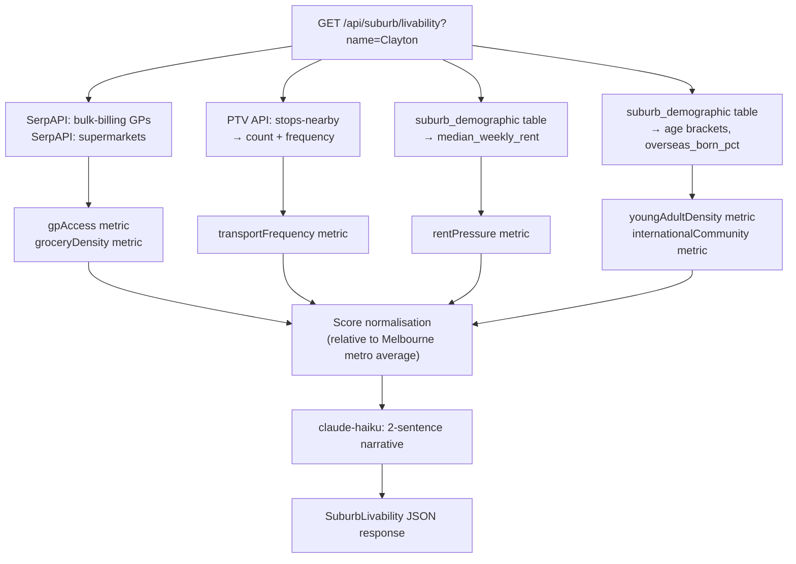

# Minuri — Iteration 3 Backlog

**Status:** Not scheduled for Iteration 3  
**Reason:** Backend pipeline scope conflicts with Epic 2 (LLM Journey) bandwidth  
**Revisit:** Iteration 4

---

## Suburb Intelligence

### Overview

Suburb Intelligence turns the suburb combobox from an input field into a briefing moment. A user who has never been to Clayton should emerge from the onboarding knowing roughly what it's like to live there — before they've left the screen.

Two surfaces: Journey onboarding (primary) and Near Me suburb context strip (secondary). The data pipeline runs on the backend; the frontend displays a pre-computed `SuburbLivability` object.

### Why Backlogged

Suburb Intelligence requires a new backend data pipeline (SerpAPI + PTV + ABS), a new endpoint, schema additions to `suburb_demographic`, and two new frontend components. This scope competes directly with the LLM Journey plan (Epic 2) and the Landing data layer (Epic 3) for the same backend developer bandwidth. The Landing evidence layer delivers measurable value to first-time visitors immediately; Suburb Intelligence enhances the experience for users already in the onboarding funnel. The backlog decision prioritises top-of-funnel conversion over mid-funnel enrichment for this iteration.

---

### Functional Requirements

| ID | Requirement | Priority |
|----|------------|----------|
| FR-S1 | After a user confirms a suburb in onboarding or Near Me, a suburb livability card shall be displayed | Must |
| FR-S2 | The livability card shall show five metrics: GP access, grocery density, transport frequency, rent pressure, and young adult density | Must |
| FR-S3 | Each metric shall be represented as a labelled bar (1–10 scale) with a key number (e.g. "6 clinics within 2 km") and a plain-English label ("Good", "Moderate", "Limited") | Must |
| FR-S4 | A two-sentence LLM-generated narrative summary shall appear below the metrics, synthesising the suburb's character for a newcomer | Must |
| FR-S5 | Livability data shall be fetched from `GET /api/suburb/livability?name=<suburb>` and cached in localStorage under `minuri:suburb:livability` with a 7-day TTL | Must |
| FR-S6 | The livability card shall appear in the Near Me suburb context strip as an expandable section | Should |
| FR-S7 | If data is unavailable for a metric, that metric row shall display "Data not available" rather than a bar | Must |
| FR-S8 | The livability card shall display the data source and vintage (e.g. "ABS 2021") for transparency | Should |

---

### Data Schema

#### localStorage Key

| Key | Owner | Shape | Lifetime |
|-----|-------|-------|---------|
| `minuri:suburb:livability` | Suburb Intelligence | `Record<suburbName, SuburbLivability>` | 7-day TTL |

#### TypeScript Interfaces

```typescript
interface SuburbMetric {
  score: number;        // 1–10; normalized against Melbourne metro average
  label: "Excellent" | "Good" | "Moderate" | "Limited" | "N/A";
  value: string;        // human-readable: "6 clinics within 2 km"
  source: string;       // e.g. "SerpAPI" | "ABS 2021" | "PTV Timetable"
}

interface SuburbLivability {
  suburb: string;
  fetchedAt: string;    // ISO timestamp; checked against 7-day TTL on read
  metrics: {
    gpAccess: SuburbMetric;
    groceryDensity: SuburbMetric;
    transportFrequency: SuburbMetric;
    rentPressure: SuburbMetric;
    youngAdultDensity: SuburbMetric;
    internationalCommunity: SuburbMetric;
  };
  summary: string;      // 2-sentence LLM-generated narrative
}
```

---

### Backend Data Pipeline

**Endpoint:** `GET /api/suburb/livability?name=<suburb>`  
**Claude model:** `claude-haiku-4-5-20251001`  
**Prompt caching:** system prompt + metric schema cached; six metric values in user turn

Five operations run in parallel:



#### Metric Sources

| Metric | Source | Computation |
|--------|--------|------------|
| GP access | SerpAPI (`"bulk billing GP near <suburb>"`) | Count results with rating ≥ 3.5 within 2 km radius; score relative to metro average |
| Grocery density | SerpAPI (`"supermarket near <suburb>"`) | Count supermarkets + markets within 1.5 km; score relative to metro average |
| Transport frequency | PTV Timetable API (`/v3/stops/location`) | Count stops within 500 m; score weighted by mode (train > tram > bus) + frequency |
| Rent pressure | `suburb_demographic` table (ABS) | `median_weekly_rent` column; score inversely (lower rent = higher score for newcomer) |
| Young adult density | `suburb_demographic` table (ABS) | Percentage aged 18–30 from age bracket columns; score relative to metro average |
| International community | `suburb_demographic` table (ABS) | `overseas_born_pct` if available; score relative to metro average |

#### Scoring Rubric

| Score | Label | Meaning |
|-------|-------|---------|
| 8–10 | Excellent | Significantly above Melbourne metro average |
| 6–7 | Good | At or above metro average |
| 4–5 | Moderate | Below metro average but functional |
| 1–3 | Limited | Significantly below metro average; prepare accordingly |

Rent pressure scoring is inverted (lower rent = higher score).

#### Database Migration Required

`suburb_demographic` table needs two columns added if absent:
```sql
ALTER TABLE suburb_demographic ADD COLUMN IF NOT EXISTS median_weekly_rent INTEGER;
ALTER TABLE suburb_demographic ADD COLUMN IF NOT EXISTS overseas_born_pct NUMERIC(5,2);
```

---

### UI Design

#### Livability Card Visual

```
Clayton
━━━━━━━━━━━━━━━━━━━━━━━━━━━━━

🏥  GP access          ████████░░  Good · 6 bulk-billing within 2 km
🛒  Groceries          █████████░  Excellent · 4 supermarkets within 1.5 km
🚌  Transport          ██████░░░░  Moderate · Glen Waverley line, 45 min to CBD
💸  Rent pressure      ████░░░░░░  Below average · $380/week median
👥  Young adults       ████████░░  High · 38% aged 18–30
🌏  International      █████████░  Very high · 52% overseas-born

"Clayton is a student-dense suburb with strong grocery access and
affordable rent. Transport to the CBD takes planning — the Glen Waverley
line runs every 20 minutes off-peak."

Sources: SerpAPI · ABS 2021 · PTV
```

Bars are CSS `width` percentage elements, not a charting library.

#### Placement — Journey Onboarding (Step 2)

- Card appears below the suburb combobox on suburb confirm
- Skeleton loading state for up to 2 seconds while data fetches
- If fetch fails, shows "Suburb data unavailable" with soft message
- User can proceed to Step 3 without livability data

#### Placement — Near Me Suburb Context Strip

- "About [suburb]" expand button below the suburb name chip
- `SuburbLivabilityCard` slides in below the strip on expand
- Collapses on second tap
- Does not re-fetch if already cached in localStorage

---

### Components Required (not yet built)

| Component | File | Purpose |
|-----------|------|---------|
| `SuburbLivabilityCard` | `components/suburb/suburb-livability-card.tsx` | Five-metric display with LLM summary; used in onboarding and Near Me |
| `SuburbMetricRow` | `components/suburb/suburb-metric-row.tsx` | Single metric row: icon, label, bar, value label, source |
| `useSuburbLivability` | `hooks/use-suburb-livability.ts` | Fetch + 7-day TTL cache; returns loading/error/data states |

---

### Acceptance Criteria (preserved)

| AC | Given | When | Then |
|----|-------|------|------|
| AC-S1 | User confirms suburb in Journey onboarding Step 2 | Livability card appears | Five metric rows visible: GP access, groceries, transport, rent, young adults; each shows bar, label, and value |
| AC-S2 | Livability card is shown | — | LLM-generated 2-sentence summary appears below the metrics |
| AC-S3 | Livability data is already cached for the selected suburb | User selects suburb again | Card appears instantly (< 100 ms); no network request made |
| AC-S4 | A metric has no data available | Card renders | That metric row shows "Data not available" label; bar absent; other metrics render normally |
| AC-S5 | User opens Near Me with a confirmed suburb | Clicks "About [suburb]" | Livability card expands in the suburb context strip |

---

### Risks

| # | Risk | Likelihood | Impact | Mitigation |
|---|------|------------|--------|-----------|
| R-S1 | Suburb livability data unavailable for outer-ring suburbs (ABS coverage gaps) | Medium | Medium | Partial data shows available metrics only; missing metrics display "Data not available"; suburb summary still generated from available data |
| R-S2 | SerpAPI rate limits hit during suburb livability fetches | Medium | Medium | Livability results cached 7 days per suburb; dev testing uses mock suburb data; production traffic per suburb is low |

---

*Minuri · Iteration 3 Backlog · TP39 · 2026-05-07*
