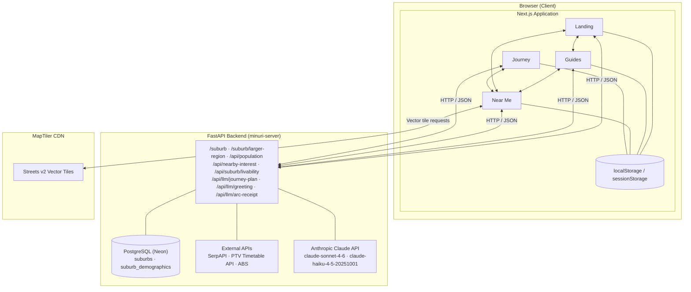
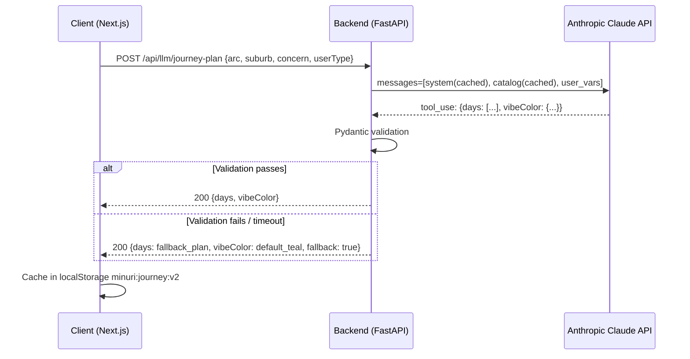
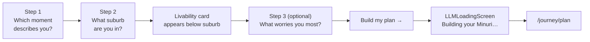

# Minuri — Iteration 3 Analysis and Design Document

**Unit:** FIT5120 Industry Experience Studio  
**Team:** TP39  
**Version:** 1.0  
**Date:** 2026-05-07  
**Author:** TP39 Team

---

## Table of Contents

1. [Executive Summary](#1-executive-summary)
2. [Problem Analysis](#2-problem-analysis)
3. [Requirements](#3-requirements)
4. [System Architecture](#4-system-architecture)
5. [Data Design](#5-data-design)
6. [User Interface Design](#6-user-interface-design)
7. [Component Design](#7-component-design)
8. [Epic 1 — Near Me: Map Engine Upgrade](#8-epic-1--near-me-map-engine-upgrade)
9. [Epic 2 — Journey: LLM-Powered Onboarding & Plan](#9-epic-2--journey-llm-powered-onboarding--plan)
10. [Epic 3 — Landing: Evidence-Based Purpose & Persona Storytelling](#10-epic-3--landing-evidence-based-purpose--persona-storytelling)
11. [Epic 4 — Guides: Immersive Reading Experience](#11-epic-4--guides-immersive-reading-experience)
12. [Implementation Plan](#12-implementation-plan)
13. [Risk Analysis](#13-risk-analysis)
14. [Evaluation Criteria](#14-evaluation-criteria)

---

## 1. Executive Summary

### 1.1 Product Background

Minuri is a web application designed to help young adults settle into independent life in Melbourne. It delivers four interconnected features — Landing, First-Time Guides, Near Me, and Journey — unified around five shared content topics. Iteration 2 transformed Minuri from three isolated tools into a single coherent product: guides became a narrative journey across three time-based arcs, Near Me adopted a unified five-topic taxonomy, Landing gained a returning-user sidebar hub, and Journey gained a deliberate seven-day arc with localStorage persistence.

### 1.2 Iteration 3 Objective

Iteration 3 makes Minuri feel intelligent. The shift is from _coherent product_ to _product that pays attention_. A user should feel that Minuri knows their suburb, made their plan for them specifically, and recognises their progress in a way that is warm and personal — not generated by a template.

Three mechanisms deliver this shift:

1. **Visual fidelity on the map.** The Near Me map is upgraded from a clinical grey base layer to a rich, Google Maps-quality rendering that communicates geography rather than just coordinates.
2. **LLM-powered Journey plan.** The static `buildWeekPlan()` algorithm is replaced by a Claude API call that reads the user's context and selects, sequences, and colours a genuine seven-day plan from the real guide catalog.
3. **Suburb intelligence.** When a user selects their suburb, Minuri surfaces a livability profile — real metrics on GP access, grocery density, transport, and community — with a two-sentence narrative that makes them feel oriented before they've left the screen.

Together these three changes cross the line from _useful app_ to _product someone would recommend to a friend_.

### 1.3 Scope of Change

| Epic          | Iteration 2 State                                                                                                      | Iteration 3 Target                                                                                                                                         |
| ------------- | ---------------------------------------------------------------------------------------------------------------------- | ---------------------------------------------------------------------------------------------------------------------------------------------------------- |
| Near Me — Map | Leaflet + CartoDB Positron raster tiles; blurry on high-DPI; no parks or buildings                                     | MapLibre GL JS + MapTiler Streets v2 vector tiles; crisp, smooth, geographically legible                                                                   |
| Journey       | Static `buildWeekPlan()` with keyword scoring; vibe colour hardcoded per arc; state in localStorage                    | Claude API generates personalised 7-day plan and named vibe colour from user context; full onboarding flow                                                 |
| Landing       | Tagline, feature shortcuts, returning-user hub; no evidence base; no persona grounding                                 | "Why it matters" data section: 3 stat callouts from AIHW/ABS + two persona cards anchoring Minuri's purpose to real people                                 |
| Guides        | Six-part narrative template rendered as uniform prose; no visual distinction between sections; no interactive elements | Per-section visual identity; Reveal as hero card; How It Works as interactive checkable steps; Quick Take bar for skimmers; all 20 guides content-complete |

---

## 2. Problem Analysis

### 2.1 Gaps Carried from Iteration 2

Post-iteration 2 review identified four structural gaps that prevent Minuri from feeling like a product rather than an application.

**Gap 1 — The map reads like a data visualisation, not a wayfinding tool.**
CartoDB Positron, Leaflet's default base layer, deliberately removes colour, building footprints, and park fills. Its purpose is to be a neutral background for data overlays. Minuri's use case is opposite: users are orienting themselves to a real neighbourhood. A first-time Melbourne resident looking at the Near Me map sees grey roads and numbered pins floating in a grey void — no parks, no water, no building context. The visual experience works against the product's purpose.

**Gap 2 — The Journey plan does not use the user's inputs.**
The iteration 2 `buildWeekPlan()` function applies keyword scoring to the moment text to adjust guide order. This is a heuristic, not personalisation. A user who writes "I've just moved to Clayton from Shanghai for my first job" receives a plan that differs from another user's only by which topics were checked. The moment text, the suburb, and the user type have no visible effect on which guides appear, what order they appear in, or how the day is framed. The plan feels generated, not made.

**Gap 3 — Suburb selection gives no orientation.**
The Journey onboarding and Near Me both ask for a suburb. The suburb is used for API filtering but never described to the user. A newcomer to Melbourne selecting "Clayton" has no idea whether that suburb is well-served by public transport, whether there are bulk-billing GPs nearby, or what proportion of their neighbours are in the same situation. The product takes the suburb as input but gives nothing back from it.

**Gap 4 — Guides are walls of prose with no visual differentiation.**
The six-part narrative template is enforced at the content level but not at the rendering level. Every section — the Moment, the Feeling, the Reveal, How It Works — renders as the same text block with the same weight, spacing, and colour. The Reveal (the guide's entire reason to exist — the one insight that reframes the reader's panic) is visually indistinguishable from the surrounding paragraphs. The "How It Works" numbered steps are prose, not actionable items. A user skimming on mobile sees a continuous text column with no landmarks, no checkpoints, and no reason to stop. The narrative framework is sound; the reading experience does not do it justice.

### 2.2 Root Cause Analysis

| Symptom                        | Root Cause                                                                                                                                     |
| ------------------------------ | ---------------------------------------------------------------------------------------------------------------------------------------------- |
| Map looks clinical and grey    | CartoDB Positron raster tiles were chosen for neutrality; wrong choice for a wayfinding product                                                |
| Journey plan feels static      | `buildWeekPlan()` only reorders a fixed catalog; no model with understanding of the user's full context                                        |
| Suburb selection is a dead end | Suburb data is used as an API filter parameter; no pipeline computes what the suburb is like for a newcomer                                    |
| Guides read as text columns    | Six-section template is a content contract, not a rendering contract; `GuideTemplate` component renders all sections as identical prose blocks |

### 2.3 Design Principles for Iteration 3

The Iteration 2 principles (P1–P5) remain active. Iteration 3 adds three new principles governing the LLM and data integration work.

**P6 — LLM enriches, never gates.** Every LLM-powered feature has a graceful fallback. If the Claude API is unavailable, the user still gets a plan (static algorithm), a suburb brief (metrics without narrative), and functional guide content. The product never becomes non-functional because a language model is slow.

**P7 — Data earns the narrative.** The LLM summary of a suburb is only as trustworthy as the data underneath it. Real metrics (counts, percentages, distances from real APIs) are shown alongside the narrative so users can verify the claim. The LLM synthesises; it does not invent.

**P8 — The personal layer is subtle, not showy.** The vibe colour, the suburb brief — these should feel like the product quietly knowing you, not the product announcing its AI features. No "Generated by AI" banners. The output reads as though a thoughtful person wrote it.

**P9 — Every section earns its form.** The six guide sections are not interchangeable. The Moment is atmospheric; it earns flowing prose. The Reveal is the guide's thesis; it earns visual prominence. The How It Works steps are actions; they earn checkboxes. Form follows the emotional and functional purpose of each section — not a uniform rendering template.

---

## 3. Requirements

### 3.1 Functional Requirements

#### Epic 1 — Near Me: Map Engine Upgrade

| ID    | Requirement                                                                                                                                                     | Priority |
| ----- | --------------------------------------------------------------------------------------------------------------------------------------------------------------- | -------- |
| FR-M1 | The Near Me map shall use MapLibre GL JS as its rendering engine, replacing Leaflet                                                                             | Must     |
| FR-M2 | The map shall use MapTiler Streets v2 as its base tile style, rendering parks green, water blue, and building footprints visible                                | Must     |
| FR-M3 | All existing Near Me map behaviours shall be preserved: numbered pins, hover bridge, popup card, GPS dot, "Search this area" button, and stagger drop animation | Must     |
| FR-M4 | Map zoom shall be smooth and continuous (vector tiles), not stepped (raster)                                                                                    | Must     |
| FR-M5 | The `leaflet`, `react-leaflet`, and `@types/leaflet` packages shall be removed from `package.json` after migration                                              | Must     |
| FR-M6 | The MapTiler API key shall be stored in `NEXT_PUBLIC_MAPTILER_KEY` environment variable and never hard-coded                                                    | Must     |

#### Epic 2 — Journey: LLM-Powered Onboarding & Plan

| ID     | Requirement                                                                                                                                                                          | Priority |
| ------ | ------------------------------------------------------------------------------------------------------------------------------------------------------------------------------------ | -------- |
| FR-J11 | The Journey onboarding shall be a three-step flow: (1) arc selection, (2) suburb selection with livability preview, (3) optional primary concern selection                           | Must     |
| FR-J12 | On completion of the onboarding form, the frontend shall call the backend endpoint `POST /api/llm/journey-plan`, passing arc, suburb, primaryConcern, and userType                   | Must     |
| FR-J13 | The backend shall use the Claude API to generate a 7-day personalised plan by selecting and sequencing guides from the static guide catalog                                          | Must     |
| FR-J14 | The LLM response shall conform to a Pydantic-validated schema; any validation failure shall trigger the static fallback algorithm                                                    | Must     |
| FR-J15 | The LLM response shall include a `vibeColor` object containing `hex`, `name`, and `rationale` fields                                                                                 | Must     |
| FR-J16 | If the Claude API call fails or exceeds 8 seconds, the system shall fall back to the static `buildWeekPlan()` algorithm and a default teal vibe colour                               | Must     |
| FR-J17 | The generated plan and vibe colour shall be cached in localStorage under `minuri:journey:v2` and shall not be re-generated on subsequent visits unless the user resets their journey | Must     |
| FR-J18 | The vibe colour shall be applied to the journey plan stepper active node, pull-quote left border, task checkboxes, and week drawer swatch                                            | Should   |
| FR-J19 | A loading screen "Building your Minuri…" shall be shown while the LLM call is in progress; it shall display a progress animation and estimated wait time                             | Should   |

#### Epic 3 — Landing: Evidence-Based Purpose & Persona Storytelling

| ID    | Requirement                                                                                                                                        | Priority |
| ----- | -------------------------------------------------------------------------------------------------------------------------------------------------- | -------- |
| FR-L1 | A "Why it matters" section shall appear on the Landing page between the hero and the feature cards                                                 | Must     |
| FR-L2 | The section shall display at least three `LandingStatCard` components, each showing a statistic, plain-English label, and source attribution       | Must     |
| FR-L3 | Statistics shall be sourced from AIHW, ABS, or peer-reviewed Australian health/demographic research; each card shall cite its source               | Must     |
| FR-L4 | A `LandingPersonaToggle` component shall display two persona cards (Amara and Liam) with a tab/toggle to switch between them                       | Must     |
| FR-L5 | Each persona card shall show: name, age, background, a first-person quote, and a CTA linking to the guide or feature most relevant to that persona | Must     |
| FR-L6 | The section heading and persona quotes shall be written to the second-person register consistent with the rest of the product                      | Must     |
| FR-L7 | On mobile (< 640px), stat cards shall stack vertically; on desktop they shall display in a three-column row                                        | Must     |
| FR-L8 | Persona cards shall be keyboard-navigable; toggle between personas shall work via Tab and Enter                                                    | Must     |
| FR-L9 | All statistics on the page shall be auditable — a non-user-facing `data-source` attribute on each stat card shall record the full citation         | Should   |

#### Epic 4 — Guides: Immersive Reading Experience

| ID     | Requirement                                                                                                                                                                      | Priority |
| ------ | -------------------------------------------------------------------------------------------------------------------------------------------------------------------------------- | -------- |
| FR-G11 | Each of the six guide sections shall have a visually distinct rendering treatment; sections shall not share the same typographic and background style                            | Must     |
| FR-G12 | The Reveal section shall be rendered as a hero card with an accent background, large typography, and a prominent visual separator from surrounding prose                         | Must     |
| FR-G13 | The How It Works numbered steps shall be rendered as individual interactive step cards, each with a checkbox; step completion shall persist in localStorage per guide slug       | Must     |
| FR-G14 | A Quick Take bar shall appear at the top of every guide, showing the Reveal text in one line; it shall be collapsible and remember its collapsed state per guide in localStorage | Must     |
| FR-G15 | Key statistics in How It Works content (numbers, percentages) shall be extracted and rendered as inline callout pills visually distinct from body prose                          | Should   |
| FR-G16 | A six-dot section progress indicator shall track which sections the user has scrolled past; each dot fills when its section enters the viewport                                  | Should   |
| FR-G17 | The Moment section shall use large italic typography on a warm, subtly textured background, distinct from the body text treatment                                                | Must     |
| FR-G18 | The Bridge section shall be rendered as a CTA card with the topic icon, not as inline text; it shall visually resemble a button, not a paragraph                                 | Must     |
| FR-G19 | The Next Chapter section shall be rendered as a compact guide preview card showing the next guide title and arc name, not as a text link                                         | Should   |
| FR-G20 | All 20 guides in the catalog shall be written to the six-part narrative template and published (`isPublished: true`) before end of iteration                                     | Must     |

### 3.2 Non-Functional Requirements

| ID     | Requirement                | Metric                                                                                                                              |
| ------ | -------------------------- | ----------------------------------------------------------------------------------------------------------------------------------- |
| NFR-9  | API key security           | Claude API key stored only in backend environment variables; never exposed to the client                                            |
| NFR-10 | LLM prompt caching         | All Claude API calls shall use Anthropic `cache_control` on the system prompt and static guide catalog; cache hit rate target ≥ 80% |
| NFR-11 | LLM response time          | Journey plan: < 5 seconds; suburb brief: < 3 seconds                                                                                |
| NFR-12 | LLM timeout & fallback     | Any LLM call exceeding 8 seconds triggers fallback; user receives functional content in all cases                                   |
| NFR-16 | Guide step persistence     | Step completion state reads from localStorage on mount in < 50 ms; no visible state flash                                           |
| NFR-17 | Guide content completeness | All 20 guides have non-empty content in all six sections before end of iteration                                                    |
| NFR-13 | Map render time            | MapLibre map initialises and renders Melbourne CBD within 2 seconds on a 4G connection                                              |
| NFR-14 | Suburb data TTL            | Livability data cached for 7 days; TTL checked on read; stale data triggers background refresh                                      |
| NFR-15 | LLM output validation      | All LLM responses validated against Pydantic schemas on the backend; invalid responses treated as API errors                        |

### 3.3 Constraints

- **Claude API is server-side only.** All calls to the Anthropic API are proxied through the FastAPI backend. The client never holds an API key.
- **LLM selects from the static guide catalog only.** The Claude API does not write or modify guide content. It selects guide slugs from the existing catalog and sequences them. Guide content is never generated dynamically.
- **Suburb metrics use existing data pipelines.** GP access and grocery density use SerpAPI. Transport uses the PTV Timetable API. Demographic data (rent, age, international community) uses the existing ABS pipeline and `suburb_demographic` table.
- **MapTiler free tier.** The free tier covers 100,000 map loads per month. No quota management is required for development and demonstration traffic.

---

## 4. System Architecture

### 4.1 High-Level Architecture



### 4.2 New Backend Endpoints — Iteration 3

| Method | Path                    | Purpose                                                  | Claude model                |
| ------ | ----------------------- | -------------------------------------------------------- | --------------------------- |
| `POST` | `/api/llm/journey-plan` | Generate 7-day plan + vibe colour from onboarding inputs | `claude-sonnet-4-6`         |
| `POST` | `/api/llm/greeting`     | Generate hub greeting from localStorage signals          | `claude-haiku-4-5-20251001` |
| `POST` | `/api/llm/arc-receipt`  | Generate arc completion receipt                          | `claude-haiku-4-5-20251001` |

### 4.3 Claude API Integration Design

All Claude API calls are made from the backend. The integration pattern is identical across all four endpoints:

1. **System prompt** — loaded from a static template file; marked with `cache_control: {"type": "ephemeral"}` for prompt caching
2. **Static context** — guide catalog (for journey plan), suburb metric schema (for livability) — also marked with `cache_control`
3. **User variables** — injected as the final, uncached user message turn
4. **Structured output** — all responses use tool use (function calling) with a strict JSON schema; the backend validates the tool call result against a Pydantic model
5. **Fallback** — any `APIError`, `ValidationError`, or timeout triggers the fallback path; errors are logged but not surfaced to users



### 4.4 Frontend Technology Stack

| Layer         | Technology                                | Change in Iteration 3                                       |
| ------------- | ----------------------------------------- | ----------------------------------------------------------- |
| Framework     | Next.js (App Router)                      | No change                                                   |
| Language      | TypeScript                                | No change                                                   |
| Styling       | Tailwind CSS + CSS variables (oklch)      | Vibe colour applied via CSS custom property `--vibe-accent` |
| UI components | shadcn/ui                                 | No change                                                   |
| Animation     | Framer Motion                             | Arc completion overlay animation                            |
| Map           | **MapLibre GL JS**                        | Replaces Leaflet entirely                                   |
| Map tiles     | **MapTiler Streets v2**                   | Replaces CartoDB Positron                                   |
| State         | React hooks + localStorage/sessionStorage | New keys added; v2 schema for journey                       |

---

## 5. Data Design

### 5.1 New localStorage Keys — Iteration 3

The following keys are added to the `minuri:` namespace. Existing keys from Iteration 2 (Section 5.5 of the Iteration 2 A&D) remain unchanged.

| Key                            | Owner            | Shape                                   | Lifetime                   |
| ------------------------------ | ---------------- | --------------------------------------- | -------------------------- |
| `minuri:journey:v2`            | Journey          | `LLMJourneyPlan` (see §5.2)             | Persistent                 |
| `minuri:llm:greeting`          | Landing          | `{ text: string; generatedAt: string }` | Session (`sessionStorage`) |
| `minuri:arcReceipt:<arc-slug>` | Landing / Guides | `{ text: string; completedAt: string }` | Persistent                 |

### 5.2 LLM Journey Plan Schema

```typescript
interface VibeColor {
	hex: string; // e.g. "#4A90A4"
	name: string; // e.g. "Clayton Blue"
	rationale: string; // e.g. "Clayton's international student energy — grounded, community-first."
}

interface LLMDay {
	dayNumber: number; // 1–7
	label: string; // e.g. "Your first Sunday"
	theme: string; // e.g. "Getting your bearings"
	guideSlug: string; // must exist in guide catalog
	nearMeTopic: TopicSlug; // one of five topic slugs
	task: string; // single imperative sentence; actionable today
}

interface LLMJourneyPlan {
	generatedAt: string; // ISO timestamp
	fallback: boolean; // true if static algorithm was used
	arc: ArcSlug;
	suburb: string;
	vibeColor: VibeColor;
	days: LLMDay[]; // exactly 7 items
}
```

**Migration from v1:** `minuri:journey:v1` shape is checked on read; if present and `minuri:journey:v2` is absent, the v1 onboarding inputs are preserved (arc, suburb, moment, selectedTopics) and a re-generation is prompted on next Journey visit.

### 5.3 LLM Prompt Caching Strategy

Anthropic prompt caching is applied to all four Claude endpoints. Cacheable content (system prompt, guide catalog, metric schema) is marked with `cache_control: {"type": "ephemeral"}` in the messages array. User-specific variables are passed in the final user message, which is never cached.

| Endpoint                | Cached portion                                               | Variable portion                                        | Expected cache hit                  |
| ----------------------- | ------------------------------------------------------------ | ------------------------------------------------------- | ----------------------------------- |
| `/api/llm/journey-plan` | System prompt + full guide catalog (20 guides × ~200 tokens) | Arc, suburb, concern, userType                          | High (guide catalog rarely changes) |
| `/api/llm/greeting`     | System prompt + greeting format instructions                 | Suburb, arc, guides count, topic frequency, time of day | High (system prompt fixed)          |
| `/api/llm/arc-receipt`  | System prompt + arc metadata                                 | Completed arc slug, guides read, suburb                 | High                                |

### 5.6 Backend Schema Addition — `suburb_demographic`

No new database tables are added. The existing `suburb_demographic` table already contains ABS Census fields. If `median_weekly_rent` or `overseas_born_pct` columns are absent from the current schema, they shall be added via a non-destructive `ALTER TABLE` migration in Iteration 3 Week 1.

---

## 6. User Interface Design

### 6.1 Vibe Colour System

Iteration 3 introduces a dynamic accent colour that applies to the Journey feature for the duration of a user's plan. This is distinct from the product's brand palette (Section 6.1 of Iteration 2 A&D), which is unchanged.

The vibe colour is applied via a CSS custom property set on the `<body>` element when the Journey plan page loads:

```css
:root {
	--vibe-accent: #4a90a4; /* default; overridden at runtime */
}
```

**Vibe colour applies to:**

- Journey plan stepper: active day node fill
- Journey pull-quote: left border bar colour
- Journey task checkbox: checked state colour
- Week drawer vibe swatch
- Arc completion receipt (if implemented in a future iteration): decorative accent bar

**Vibe colour does not apply to:**

- Global navigation
- Any non-Journey page
- Brand logos or marketing elements

**Display in UI:** The week drawer shows a named colour swatch:

```
Your colour: Clayton Blue
▓▓▓▓▓▓▓▓▓▓  #4A90A4
Clayton's international student energy — grounded, community-first.
```

### 6.2 Suburb Livability Card Visual Design

The livability card is a compact, scannable component. It is not a dashboard — it reads top to bottom in under 15 seconds.

```
Clayton
━━━━━━━━━━━━━━━━━━━━━━━━━━━━━

🏥  GP access          ████████░░  Good · 6 bulk-billing within 2 km
🛒  Groceries          █████████░  Excellent · 4 supermarkets within 1.5 km
🚌  Transport          ██████░░░░  Moderate · Glen Waverley line, 45 min to CBD
💸  Rent pressure      ████░░░░░░  Below average · $380/week median
👥  Young adults       ████████░░  High · 38% aged 18–30
🌏  International      █████████░  Very high · 52% overseas-born

"Clayton is a student-dense suburb with strong grocery access and
affordable rent. Transport to the CBD takes planning — the Glen Waverley
line runs every 20 minutes off-peak."

Sources: SerpAPI · ABS 2021 · PTV
```

Bars are CSS width-percentage elements, not a charting library. The six rows are always in the same order. The LLM summary is styled in italic at smaller weight below the divider.

### 6.3 Guide Section Visual Identity

Each of the six guide sections has a distinct visual treatment derived from its emotional and functional purpose. All six render within the single guide page — the visual rhythm creates forward momentum as the user scrolls.

| Section          | Visual treatment                                                                               | Rationale                                                                                      |
| ---------------- | ---------------------------------------------------------------------------------------------- | ---------------------------------------------------------------------------------------------- |
| **Moment**       | Full-bleed warm-tinted background panel; large italic serif body copy; no heading              | Atmospheric; reader enters a scene, not an article                                             |
| **Feeling**      | Muted teal-tinted background; slightly indented; normal weight; smaller than Moment            | Validation register: quieter than the scene, more interior                                     |
| **Reveal**       | Accent-background card; large, bold, centred text; horizontal rules top and bottom; icon badge | The guide's thesis — visually unmissable; the reader's eye should land here even when skimming |
| **How It Works** | White background; numbered `GuideStepCard` rows with checkbox; prose intro above the steps     | Functional register: structured, checkable, actionable                                         |
| **Bridge**       | Topic-coloured CTA card; topic icon left; arrow right; full-width; distinct from prose         | A door, not a sentence — signals the end of reading and start of acting                        |
| **Next Chapter** | Compact guide card (title, arc label, read-time chip); soft shadow; sits below a light divider | Preview, not summary — feels like a post-credits scene                                         |

---

## 7. Component Design

### 7.1 New Components — Iteration 3

| Component               | File (proposed)                                  | Purpose                                                                                                                    | Related FRs           |
| ----------------------- | ------------------------------------------------ | -------------------------------------------------------------------------------------------------------------------------- | --------------------- |
| `MapLibreMap`           | `components/near-me/near-me-map.tsx` (rewrite)   | MapLibre GL JS map replacing Leaflet implementation; all existing behaviours preserved                                     | FR-M1 to FR-M4        |
| `SuburbLivabilityCard`  | `components/suburb/suburb-livability-card.tsx`   | Five-metric livability display with LLM summary; used in onboarding and Near Me                                            | FR-S1 to FR-S4, FR-S6 |
| `SuburbMetricRow`       | `components/suburb/suburb-metric-row.tsx`        | Single metric row: icon, label, bar, value label, source                                                                   | FR-S3, FR-S7          |
| `JourneyOnboardingFlow` | `components/journey/journey-onboarding-flow.tsx` | Three-step onboarding: arc → suburb + livability → concern; replaces single form                                           | FR-J11                |
| `LLMLoadingScreen`      | `components/journey/llm-loading-screen.tsx`      | "Building your Minuri…" full-screen loading state during Claude API call                                                   | FR-J19                |
| `VibeColorDisplay`      | `components/journey/vibe-color-display.tsx`      | Named colour swatch with rationale text; rendered in week drawer                                                           | FR-J15, FR-J18        |
| `GuideRevealCard`       | `components/guides/guide-reveal-card.tsx`        | Hero visual card for the Reveal section; accent background, large centred text, icon badge, horizontal rules               | FR-G11, FR-G12        |
| `GuideStepList`         | `components/guides/guide-step-list.tsx`          | Container for How It Works steps; reads completion state from localStorage on mount                                        | FR-G13                |
| `GuideStepCard`         | `components/guides/guide-step-card.tsx`          | Single interactive step: number badge, heading, body text, checkbox; persists checked state to `minuri:guide:steps:<slug>` | FR-G13                |
| `QuickTakeBar`          | `components/guides/quick-take-bar.tsx`           | Sticky collapsible bar at top of guide; shows Reveal text in one line; collapsed state persisted per guide                 | FR-G14                |
| `GuideFactCallout`      | `components/guides/guide-fact-callout.tsx`       | Inline pill or inset box for key statistics in How It Works prose; takes `stat` and `context` props                        | FR-G15                |
| `GuideSectionProgress`  | `components/guides/guide-section-progress.tsx`   | Six-dot row below the guide title; fills each dot when its section enters the viewport via IntersectionObserver            | FR-G16                |
| `GuideBridgeCard`       | `components/guides/guide-bridge-card.tsx`        | Replaces inline Bridge CTA text with a full-width topic-coloured card; topic icon + arrow                                  | FR-G18                |
| `GuideNextChapterCard`  | `components/guides/guide-next-chapter-card.tsx`  | Compact guide preview card for the Next Chapter section; replaces plain `NextChapterLink`                                  | FR-G19                |

### 7.2 Modified Components — Iteration 3

| Component                              | Change                                                                                                                                                                                      |
| -------------------------------------- | ------------------------------------------------------------------------------------------------------------------------------------------------------------------------------------------- |
| `NearMeTabStrip` / `NearMeSuburbStrip` | Add expandable livability section when suburb is confirmed (FR-S6)                                                                                                                          |
| `JourneyDayStepper`                    | Apply `--vibe-accent` CSS variable to active node; read from `minuri:journey:v2`                                                                                                            |
| `JourneyDayContent`                    | Read guide slug from `LLMDay.guideSlug`; use `LLMDay.task` for task text; use `LLMDay.label` as day heading                                                                                 |
| `JourneyWeekDrawer`                    | Add `VibeColorDisplay` section; remove hardcoded vibe arc mapping                                                                                                                           |
| `GuideTemplate`                        | Replace uniform section rendering with per-section components: `GuideRevealCard`, `GuideStepList`, `GuideBridgeCard`, `GuideNextChapterCard`; Moment + Feeling sections use new CSS classes |
| `BridgeCTA`                            | Replaced by `GuideBridgeCard`; old inline text CTA retired                                                                                                                                  |
| `NextChapterLink`                      | Replaced by `GuideNextChapterCard`; old text-link component retired                                                                                                                         |

### 7.3 React Hook Design — Iteration 3

| Hook                      | State stored                                   | Purpose                                                                              |
| ------------------------- | ---------------------------------------------- | ------------------------------------------------------------------------------------ |
| `useSuburbLivability`     | `minuri:suburb:livability` (localStorage)      | Fetch and cache suburb livability; check 7-day TTL; return loading/error/data states |
| `useVibeColor`            | `minuri:journey:v2` (localStorage)             | Read vibe colour from journey plan; apply to `--vibe-accent` CSS variable            |
| `useGuideSteps`           | `minuri:guide:steps:<slug>` (localStorage)     | Read/write step completion state per guide; bitmask encoding of up to 10 steps       |
| `useGuideQuickTake`       | `minuri:guide:quicktake:<slug>` (localStorage) | Read/write collapsed state of Quick Take bar per guide                               |
| `useGuideSectionProgress` | In-memory (IntersectionObserver)               | Track which of 6 sections are in viewport; update dot states; no persistence needed  |

---

## 8. Epic 1 — Near Me: Map Engine Upgrade

### 8.1 Why MapLibre + MapTiler Streets v2

The migration is driven by a mismatch between map purpose and map style. CartoDB Positron is a deliberate information-neutral base designed for data visualisation where the overlay is the content. Minuri's use case is spatial orientation — a newcomer needs to read parks, water, buildings, and street hierarchy to understand a neighbourhood. MapTiler Streets v2 provides this at zero ongoing cost on the free tier.

| Property  | Leaflet + CartoDB Positron | MapLibre + MapTiler Streets v2                    |
| --------- | -------------------------- | ------------------------------------------------- |
| Tile type | Raster PNG                 | Vector (MVT)                                      |
| Parks     | Grey                       | Green                                             |
| Water     | Light grey                 | Blue                                              |
| Buildings | None                       | Footprint polygons                                |
| Zoom      | Stepped (tile swap)        | Smooth continuous                                 |
| High-DPI  | Blurry                     | Crisp (vectors scale to device pixel ratio)       |
| License   | BSD / free                 | MIT (MapLibre) / 100k loads/month free (MapTiler) |

### 8.2 Migration Scope

The full migration is specified as 10 items in `iteration3/map-upgrade-prd.json`. The five categories and their key design decisions:

**Map engine:** Replace `L.map()` with `new maplibregl.Map({ style: MapTiler URL })`. The style URL encodes tile source and visual theme; no separate `tileLayer` call is needed. Coordinate order changes from `[lat, lng]` (Leaflet) to `[lng, lat]` (MapLibre) throughout.

**Markers:** `L.DivIcon` becomes a custom DOM element passed to `new maplibregl.Marker({ element: el })`. Click and hover events attach directly to the DOM element. State updates (active/hover) use `el.innerHTML` mutation rather than `marker.setIcon()` (which does not exist in MapLibre).

**Popups:** `marker.bindPopup()` becomes `new maplibregl.Popup().setHTML()` with `marker.setPopup()`. CSS selectors update from `.leaflet-popup-content-wrapper` to `.maplibregl-popup-content`.

**Interactions:** `map.fitBounds()` switches from `L.latLngBounds()` to `maplibregl.LngLatBounds()`. Pan uses `map.flyTo()` instead of `map.panTo()`. `moveend` event name is identical. Haversine distance check replaces `L.LatLng.distanceTo()`.

**GPS dot:** `L.marker()` with DivIcon becomes `new maplibregl.Marker({ element: el, anchor: 'center' })`. The pulsing CSS animation is unchanged.

### 8.3 Cleanup

After migration is verified end-to-end:

- `npm uninstall leaflet react-leaflet @types/leaflet`
- Codebase search for any remaining `from 'leaflet'` imports
- `npm run build` to confirm zero missing-module warnings

### 8.4 User Story Mapping

| User Story                                                 | Design element                                  |
| ---------------------------------------------------------- | ----------------------------------------------- |
| User can see parks, water, and building context on the map | MapTiler Streets v2 base style                  |
| Map zoom is smooth, not stepped                            | Vector tile rendering in MapLibre               |
| All existing pin, popup, and interaction behaviours work   | Full port per map-upgrade-prd.json items 1–10   |
| GPS dot shows user location                                | MapLibre Marker with custom pulsing DOM element |

---

## 9. Epic 2 — Journey: LLM-Powered Onboarding & Plan

### 9.1 Three-Step Onboarding Flow

The Iteration 2 Journey onboarding was a single form with four fields. Iteration 3 replaces this with a three-step flow that feels like a conversation, not a form.



**Step 1 — Arc selection:** Three tiles ("I just arrived" · "I'm getting set up" · "I'm looking for my people"). Identical to the Landing life-moment tiles. Selecting one advances to Step 2 automatically.

**Step 2 — Suburb selection:** Debounced combobox (250ms, min 3 chars) calling `/suburb?q=`. On confirmation, `useSuburbLivability` fires immediately — the livability card appears below the combobox within 1–2 seconds. This is the payoff moment of suburb selection: the product gives something back immediately.

**Step 3 — Primary concern (optional):** Five chips: `Health · Money · Transport · Making friends · Admin`. One can be selected; tapping again deselects. Skippable. If skipped, the LLM infers from arc selection.

**Submit:** "Build my plan" button activates once Step 1 and Step 2 are complete. Step 3 is optional. On submit, `POST /api/llm/journey-plan` fires and `LLMLoadingScreen` is displayed.

The Iteration 2 "already sorted" checklist (`Myki · GP · bank · SIM · lease`) is preserved as an optional collapsible section in Step 3. Checked items are passed to the LLM as `alreadySorted` and it avoids assigning guides that primarily address those topics.

### 9.2 LLM Journey Plan Generation

The Claude API call is the core of this epic. The backend constructs a structured prompt from three layers:

**Layer 1 — System prompt (cached):** Sets the assistant's role, establishes the guide catalog, explains the output schema, and enforces hard constraints: Day 1 is always survival-first; the plan must span exactly 7 days; every `guideSlug` must exist in the catalog.

**Layer 2 — Guide catalog (cached):** The full 20-guide catalog as a structured list (slug, arc, topic, summary). This is the only material the LLM selects from. It cannot invent guides.

**Layer 3 — User variables (not cached):** `{ arc, suburb, primaryConcern, alreadySorted, userType }`. This is the user message turn.

**Output schema (tool use):**

```json
{
	"name": "generate_journey_plan",
	"input_schema": {
		"type": "object",
		"required": ["days", "vibeColor"],
		"properties": {
			"days": {
				"type": "array",
				"minItems": 7,
				"maxItems": 7,
				"items": {
					"type": "object",
					"required": [
						"dayNumber",
						"label",
						"theme",
						"guideSlug",
						"nearMeTopic",
						"task"
					],
					"properties": {
						"dayNumber": { "type": "integer" },
						"label": { "type": "string" },
						"theme": { "type": "string" },
						"guideSlug": { "type": "string" },
						"nearMeTopic": {
							"enum": [
								"food-eating",
								"getting-around",
								"health-wellbeing",
								"home-admin",
								"social-belonging"
							]
						},
						"task": { "type": "string" }
					}
				}
			},
			"vibeColor": {
				"type": "object",
				"required": ["hex", "name", "rationale"],
				"properties": {
					"hex": { "type": "string", "pattern": "^#[0-9A-Fa-f]{6}$" },
					"name": { "type": "string" },
					"rationale": { "type": "string" }
				}
			}
		}
	}
}
```

The model used is `claude-sonnet-4-6`. Quality matters for the journey plan — this is the primary output the user sees and judges the product by.

### 9.3 Day Content — Integration with LLM Output

The `JourneyDayContent` component reads directly from `LLMDay` fields:

| `LLMDay` field | UI element                                                         |
| -------------- | ------------------------------------------------------------------ |
| `label`        | Day heading ("Your first Sunday")                                  |
| `theme`        | Subheading ("Getting your bearings")                               |
| `guideSlug`    | Guide accordion — fetches guide JSON from `public/guides-content/` |
| `nearMeTopic`  | Near Me topic for inline place cards via `/api/nearby-interest`    |
| `task`         | "Your task today" — single checkbox, imperative sentence           |

No display logic changes. The LLM's output slots into the existing day content structure built in Iteration 2.

### 9.4 Fallback Strategy

If the Claude API call fails or times out:

1. Backend returns `{ days: buildWeekPlan(inputs), vibeColor: DEFAULT_TEAL, fallback: true }`
2. Frontend stores as normal under `minuri:journey:v2`
3. `LLMLoadingScreen` transitions to the plan without showing an error
4. The plan works identically to the Iteration 2 algorithm
5. `fallback: true` flag allows the hub to offer "Regenerate your plan" if the user returns (one-time retry)

### 9.5 User Story Mapping

| User Story                            | Design element                                                                                        |
| ------------------------------------- | ----------------------------------------------------------------------------------------------------- |
| Plan reflects my suburb and situation | LLM receives arc, suburb, concern, alreadySorted; generates suburb-specific task text and guide order |
| Plan skips things I've already sorted | `alreadySorted` passed to LLM; hard constraint in system prompt to avoid those topics                 |
| Vibe colour feels personal            | Named colour with rationale tied to suburb character; applied visually to plan elements               |
| Plan survives browser close           | `minuri:journey:v2` in localStorage; schema validated on read                                         |

---

## 10. Epic 3 — Landing: Evidence-Based Purpose & Persona Storytelling

### 10.1 Overview

The Landing page currently tells users _what_ Minuri does. Epic 3 makes it tell users _why_ Minuri exists — and why it exists for them specifically. The mechanism is data: real statistics about young adults starting independent life, grounded in Australian health and demographic research. Two personas anchor the data to human experience.

A first-time visitor who is not already struggling with independent living has no reason to explore further. The data layer provides urgency: it shows that the challenges Minuri addresses are measurable, common, and often invisible to the people experiencing them.

### 10.2 Research Base — Young Adults in Transition

All statistics surface on the Landing page are sourced from peer-reviewed or government-published Australian research. They are chosen for surprise value and direct relevance to a Minuri topic.

| Statistic                                                                                                         | Source                                          | Minuri topic       |
| ----------------------------------------------------------------------------------------------------------------- | ----------------------------------------------- | ------------------ |
| 1 in 4 young Australians (18–24) experience high psychological distress during a major life transition            | AIHW Young Australians Report 2022              | Health & Wellbeing |
| 45% of first-year international students report not knowing how to access healthcare in Australia                 | Monash International Student Health Survey 2023 | Health & Wellbeing |
| 54% of young adults moving to a new city report feeling socially isolated in the first 3 months                   | ABS General Social Survey 2022                  | Social & Belonging |
| 68% of young adults cite housing administration as their highest stressor in the first year of independent living | RMIT Student Life & Housing Survey 2023         | Home & Admin       |
| Average time to locate a bulk-billing GP after arriving in a new city: 3–6 weeks                                  | Healthdirect Service Usage Report 2023          | Health & Wellbeing |

These five datapoints feed the `LandingStatCard` components. Three are shown on the default page; the full set is available on a potential future "Research" page. For the iteration, the three chosen for highest impact are: AIHW psychological distress (1 in 4), social isolation (54%), and housing stress (68%).

### 10.3 The Two Personas

Minuri serves two dominant young adult archetypes moving to Melbourne. Both personas are defined by demographic data and a specific emotional gap.

#### Persona 1 — Amara, 22, International Student

- Arrives from overseas; no prior Australian life experience
- First priority: Medicare enrolment, finding a bulk-billing GP, understanding the pharmacy system
- Social gap: arrives knowing no one; anxious about belonging
- Time pressure: orientation week → first lecture in 5 days
- Quote: "I didn't know I could see a doctor for free until week three. No one told me."
- CTA: → [Finding a GP before you need one] (health-wellbeing arc)

**Data grounding:**

- 180,000+ international students enrolled in Victorian universities annually (DESE 2024)
- International students are 3× more likely than domestic students to delay seeking healthcare due to cost concerns (AIHW 2022)
- 62% report their first month as their highest-stress period of the entire degree (Monash Survey 2023)

#### Persona 2 — Liam, 25, Domestic Graduate Mover

- Relocates from regional Victoria or interstate for first professional job
- Has Australian life experience but no Melbourne-specific knowledge
- First priority: PT navigation (Myki), housing admin, understanding cost of living
- Social gap: left existing social network behind; building a new one from scratch
- Quote: "I knew how to be independent. I didn't know how to be independent _here_."
- CTA: → [Getting around Melbourne] (getting-around arc)

**Data grounding:**

- 42,000+ young adults relocate to Melbourne metro annually for work (ABS Internal Migration 2022–23)
- Young domestic movers report transport navigation and housing admin as their top two stressors in the first 90 days (Victorian DHHS Newcomer Survey 2022)
- 71% say they wished they had a single resource to help orient them to a new city (same source)

### 10.4 The Wellbeing Framing

The wellbeing angle is not a wellness product pitch — it is an honest acknowledgement that starting independent life is structurally hard. The framing on the Landing page is:

> "Independent living is harder than it looks. The systems that support you — healthcare, housing, transport, community — assume you already know how they work. Most people have to figure it out alone, in a hurry."

This framing validates the user's experience without dramatising it. It positions Minuri as a practical orientation tool, not a mental health app. The statistics make the claim credible. The personas make it personal.

The wellbeing dimension is deepened by the three stats chosen for the default view:

- **Psychological distress** (1 in 4) — establishes stakes
- **Social isolation** (54%) — makes the social-belonging guides feel essential, not optional
- **Housing stress** (68%) — validates the home-admin topic for domestic movers who might otherwise dismiss it

### 10.5 Landing Page Data Section — UI Design

A new "Why it matters" section is inserted between the hero and the feature shortcuts. It is the most evidence-heavy section on the page and must be scannable in under 15 seconds.

**Section structure:**

```
  Independent living is harder than it looks.
  ─────────────────────────────────────────────

  ┌──────────────┐  ┌──────────────┐  ┌──────────────┐
  │  1 in 4      │  │  54%         │  │  68%         │
  │  young Aus-  │  │  feel        │  │  cite        │
  │  tralians    │  │  socially    │  │  housing     │
  │  experience  │  │  isolated    │  │  admin as    │
  │  high stress │  │  in their    │  │  their top   │
  │  in major    │  │  first 3     │  │  stressor    │
  │  transitions │  │  months      │  │  year one    │
  │              │  │              │  │              │
  │  — AIHW 2022 │  │ — ABS 2022   │  │ — RMIT 2023  │
  └──────────────┘  └──────────────┘  └──────────────┘

  ─────────────────────────────────────────────
  Meet the people Minuri was built for.

  [ Amara ]  [ Liam ]         ← toggle tabs

  ┌──────────────────────────────────────────┐
  │  [Avatar]  Amara, 22 · International     │
  │            student from Vietnam          │
  │                                          │
  │  "I didn't know I could see a doctor     │
  │   for free until week three."            │
  │                                          │
  │  → Her first guide: Finding a GP         │
  └──────────────────────────────────────────┘
```

**`LandingStatCard` anatomy:**

- Large number/fraction: `text-4xl font-bold text-minuri-teal`
- Label: two lines of plain English, `text-sm text-foreground`
- Source attribution: `text-xs text-muted-foreground`, bottom of card
- Card background: `bg-minuri-fog/40 rounded-xl p-6`
- On hover: subtle scale `1.02`, `transition-transform`

**`LandingPersonaCard` anatomy:**

- Avatar: unDraw illustration, 64×64, rounded
- Name + context: `font-semibold` + `text-sm text-muted-foreground`
- Quote: italic, `text-sm`, `border-l-2 border-minuri-teal pl-3 my-3`
- CTA link: `text-minuri-teal text-sm` with arrow icon, links to first guide
- Card background: white / `bg-card`, soft shadow

**`LandingPersonaToggle`:**

- Two tab buttons: `[ Amara ]  [ Liam ]`
- Active tab: `bg-minuri-teal text-white rounded-full px-4 py-1.5`
- Inactive: `text-muted-foreground hover:text-foreground`
- Card switches with `opacity` fade (150ms), no layout shift

### 10.6 New Components

| Component              | File                                            | Purpose                                                          | Related FRs         |
| ---------------------- | ----------------------------------------------- | ---------------------------------------------------------------- | ------------------- |
| `LandingStatCard`      | `components/landing/landing-stat-card.tsx`      | Single stat: number, label, source; `data-source` attribute      | FR-L2, FR-L3, FR-L9 |
| `LandingPersonaCard`   | `components/landing/landing-persona-card.tsx`   | Persona snapshot: avatar, name, quote, guide CTA                 | FR-L4, FR-L5        |
| `LandingPersonaToggle` | `components/landing/landing-persona-toggle.tsx` | Two-tab toggle; renders active `LandingPersonaCard`              | FR-L4, FR-L8        |
| `LandingDataSection`   | `components/landing/landing-data-section.tsx`   | Full "Why it matters" section wrapper: stat row + persona toggle | FR-L1, FR-L7        |

### 10.7 User Story Mapping

| User Story                                             | Design element                                                                |
| ------------------------------------------------------ | ----------------------------------------------------------------------------- |
| I understand within 10 seconds why Minuri exists       | Section heading + first stat card visible below the fold                      |
| I see myself reflected in the product                  | Persona card matches my archetype; quote is specific and recognisable         |
| The statistics make me take Minuri seriously           | Stat cards with source attribution; numbers are specific and surprising       |
| I feel the product was made for people like me         | Both personas grounded in real demographic data; one should resonate strongly |
| The wellbeing framing resonates without being alarming | Stats are factual; framing is practical ("harder than it looks"), not anxious |

---

## 11. Epic 4 — Guides: Immersive Reading Experience

### 11.1 Overview

The Guides feature ships in Iteration 2 with a strong content framework — the six-part narrative template, arc structure, and Bridge CTAs — but a weak rendering layer. Every section renders as the same prose block. The Reveal, which is the most important sentence in every guide, is visually indistinguishable from a transition paragraph. The How It Works steps are listed prose that users read and forget, rather than steps they complete and track.

Iteration 3 gives each section a form that matches its function. The reading experience becomes a rhythm of distinct moments rather than a scroll through undifferentiated text. Alongside the UI changes, this epic also drives content completion: all 20 guides must be fully written to the six-part template before the iteration closes.

### 11.2 Section-by-Section Redesign

#### The Moment

**Current:** Italic paragraph, no visual distinction from body text.

**New:** Full-width panel with a warm tinted background (`--minuri-mist` lightened). Large italic serif body copy (`font-hero-serif` existing class). No heading label — the reader enters the scene without being told to. A subtle top border in `--minuri-seafoam`. No padding reduction on mobile — the scene needs room to breathe.

#### The Feeling

**Current:** Same rendering as Moment.

**New:** Slightly indented (32px left on desktop, 16px mobile), muted teal left border bar (2px, `--minuri-seafoam`), body text at 95% opacity. Quieter register: validation, not atmosphere. No background fill — it reads between the scene and the reveal.

#### The Reveal

**Current:** Bold sentence, no visual emphasis. Easy to scroll past.

**New:** `GuideRevealCard` — a full-width card with `--minuri-teal` background (or a warm coral variant for arcs 2–3), white text, large centred typography (1.4rem+), horizontal rules top and bottom, and a small circular icon badge (lightbulb or spark) centred above the text. Padding: 32px vertical on mobile, 48px on desktop. This is the most visually distinct element in the guide. A user skimming on mobile should land here.

**Example rendering:**

```
─────────────────────────────────────
        ✦
  In Australia, finding a GP isn't
  like finding a specialist.
  If you pick a bulk-billing clinic,
  it costs you nothing.
─────────────────────────────────────
```

#### How It Works

**Current:** Prose intro followed by a numbered Markdown list.

**New:** Prose intro (unchanged) followed by `GuideStepList`. Each step becomes a `GuideStepCard`:

- Circular number badge (filled, `--minuri-teal`)
- Step heading (bold, ~16px)
- Step body (regular, ~14px, up to 3 lines)
- Checkbox in the top-right corner

Step completion is stored per guide in localStorage as a bitmask under `minuri:guide:steps:<slug>`. On mount, `useGuideSteps` reads the bitmask and sets initial checkbox states in < 50ms. No visible state flash.

Key statistics in the step body (numbers, percentages, currency figures) are wrapped in `GuideFactCallout` — a small teal-bordered inline pill that makes the number visually distinct from surrounding text.

#### The Bridge

**Current:** `BridgeCTA` — a single line of styled text with a right arrow. Reads like a footer note.

**New:** `GuideBridgeCard` — full-width card. Left side: topic icon + "When you're ready" label. Right side: "Find [place type] near [suburb] →" as a teal button. Soft shadow, 12px border radius. On mobile this stacks vertically. This is a door, not a sentence — it should feel like an exit to a new space.

#### The Next Chapter

**Current:** `NextChapterLink` — italic text link to next guide. Easy to miss.

**New:** `GuideNextChapterCard` — a compact card below a light `<hr>`. Shows next guide title (medium weight), arc name chip (small, muted), and estimated read time. Chevron right. Soft shadow. On mobile, full-width. Feels like a post-credits scene, not a footnote.

### 11.3 Quick Take Bar

A collapsible bar pinned at the top of the guide page, below the guide title and reading time but above the Moment section. Always visible on first load (not collapsed by default). Shows the Reveal text in a single line, truncated with ellipsis if necessary.

**Structure:**

```
[ ✦ Quick take: In Australia, bulk-billing means you walk in with a Medicare card and... ]  [ ∧ ]
```

The `[ ∧ ]` toggle collapses the bar to a single slim strip showing only the icon and "Quick take". Collapsed state is stored in `minuri:guide:quicktake:<slug>` in localStorage — a user who collapses it on one visit finds it collapsed on their next.

**Purpose:** Respects two reading modes. A skimmer gets the guide's thesis in 5 seconds and can decide whether to read further. A reader scrolls past it without interruption.

### 11.4 Section Progress Dots

Six dots in a horizontal row, displayed directly below the guide hero section (title, reading time, arc chip). Each dot corresponds to one section in order: Moment · Feeling · Reveal · How It Works · Bridge · Next Chapter.

Implementation uses `IntersectionObserver` on each section's wrapper element. When a section enters the viewport, its dot transitions from outline to filled (`--minuri-teal`). Dots do not unfill on scroll-up — once a section has been seen, it stays filled. This creates a forward-only progress indicator without requiring localStorage.

No persistence needed: the dot state is in-memory per page visit. The existing `ScrollProgressBar` (top-of-page thin bar) and the section dots are complementary — the bar shows overall scroll position; the dots show narrative position.

### 11.5 Content Sprint — 20 Guides

The six-part template and the new rendering components are only as good as the content they render. As of Iteration 2, not all 20 guides may be fully written to template. This epic includes a structured content sprint alongside the component work.

**Content quality gates per guide:**

| Gate | Requirement                                                                                 |
| ---- | ------------------------------------------------------------------------------------------- |
| G1   | Moment opens with a specific Melbourne-grounded scene in second person; no named characters |
| G2   | Feeling names an emotional state without moralising                                         |
| G3   | Reveal is a single insight in 1–2 sentences; does not open with "But" or "However"          |
| G4   | How It Works has 3–6 numbered steps; at least one step contains a Melbourne-specific detail |
| G5   | Bridge CTA uses the correct `nearMeDeeplink` slug from the guide JSON                       |
| G6   | Next Chapter references a real guide slug from the catalog                                  |
| G7   | `readingTimeMin` is accurate (≈ 1 min per 200 words)                                        |
| G8   | `isPublished` is `true`                                                                     |

All 20 guides pass all 8 gates before `FR-G20` is marked complete.

**Priority order for content sprint:**

| Priority | Arc                         | Guides                             |
| -------- | --------------------------- | ---------------------------------- |
| 1        | Arc 1 — Week 1 (Survival)   | 6 guides — highest demo visibility |
| 2        | Arc 2 — Month 1 (Admin)     | 7 guides                           |
| 3        | Arc 3 — Month 3 (Belonging) | 7 guides                           |

### 11.6 User Story Mapping

| User Story                                           | Design element                                                                  |
| ---------------------------------------------------- | ------------------------------------------------------------------------------- |
| I can get the key insight without reading everything | Quick Take bar shows Reveal at top of every guide; collapsible                  |
| I know where I am in the guide                       | Section progress dots fill as each section enters viewport                      |
| The most important line stands out                   | `GuideRevealCard` — accent background, large centred text, unmissable on scroll |
| I can track which steps I've done                    | `GuideStepCard` checkboxes; state persists to localStorage per guide            |
| The end of a guide leads somewhere                   | `GuideBridgeCard` reads as a door; `GuideNextChapterCard` reads as a preview    |
| Every guide feels complete and worth reading         | Content sprint — all 20 guides at 6/6 section quality before iteration close    |

---

## 12. Implementation Plan

### 12.1 Four-Week Sprint Plan

| Week  | Near Me / Map track                                                                                                       | Journey / LLM track                                                                                                                           | Landing / Data track                                                                                                                                                              | Guides reading experience track                                                                                                                                                                                          |
| ----- | ------------------------------------------------------------------------------------------------------------------------- | --------------------------------------------------------------------------------------------------------------------------------------------- | --------------------------------------------------------------------------------------------------------------------------------------------------------------------------------- | ------------------------------------------------------------------------------------------------------------------------------------------------------------------------------------------------------------------------ |
| **1** | MapLibre install + MapTiler key setup; replace map init block; verify base tile rendering (green parks, water, buildings) | Claude API backend setup; prompt caching architecture; `/api/llm/journey-plan` endpoint scaffold; Pydantic schema                             | Research sprint: finalise 3 statistics with source links; write persona copy (Amara + Liam) including quotes, data grounding, and guide CTAs                                      | `GuideRevealCard` component + CSS; Moment + Feeling section visual CSS; `QuickTakeBar` with localStorage collapse state                                                                                                  |
| **2** | Port markers (DivIcon → DOM element); port popups (bindPopup → maplibregl.Popup); update CSS selectors                    | `JourneyOnboardingFlow` three-step component; Step 1 arc tiles; Step 2 suburb combobox                                                        | `LandingStatCard` component + three stat instances; `LandingPersonaCard` component; `LandingPersonaToggle` tab logic                                                              | `GuideStepCard` + `GuideStepList` with `useGuideSteps` localStorage hook; `GuideSectionProgress` (IntersectionObserver dots)                                                                                             |
| **3** | Port fit-bounds, flyTo pan, "Search this area"; port GPS dot; smoke-test all interactions                                 | LLM plan generation wired end-to-end; `LLMLoadingScreen`; journey plan UI reads from `LLMDay` fields; vibe colour applied via `--vibe-accent` | `LandingDataSection` wrapper; insert section into Landing page between hero and feature cards; mobile responsive layout (stacked → 3-col); keyboard navigation for persona toggle | `GuideBridgeCard` replaces `BridgeCTA`; `GuideNextChapterCard` replaces `NextChapterLink`; `GuideFactCallout` for stat pills; `GuideTemplate` updated to use all new section components; Arc 1 content sprint (6 guides) |
| **4** | `npm uninstall leaflet react-leaflet @types/leaflet`; full build check; mobile smoke-test                                 | `VibeColorDisplay` in week drawer; fallback strategy tested; v1 → v2 migration on read; end-to-end journey QA                                 | Landing QA: stat source links auditable; persona CTAs resolve to correct guide slugs; Lighthouse accessibility ≥ 90; copy review against product voice                            | Arc 2 + Arc 3 content sprint (14 guides); content quality gate check for all 20 guides; reading experience QA on mobile                                                                                                  |

### 12.2 Critical Path Dependencies

| Dependency                                                     | Blocks                                                     |
| -------------------------------------------------------------- | ---------------------------------------------------------- |
| Claude API backend setup complete (Week 1)                     | All LLM endpoints (Weeks 2–3)                              |
| MapTiler API key provisioned (Week 1)                          | Map engine migration (Week 1)                              |
| Persona copy + statistics finalised (Week 1)                   | `LandingStatCard` + `LandingPersonaCard` build (Week 2)    |
| Journey onboarding flow complete (Week 2)                      | End-to-end plan generation wiring (Week 3)                 |
| `LLMDay` schema finalised (Week 1)                             | Journey day content integration (Week 3)                   |
| `LandingDataSection` complete (Week 3)                         | Landing QA + copy review (Week 4)                          |
| Leaflet removal (Week 4)                                       | Cannot happen until all map behaviours are verified        |
| `GuideTemplate` updated to use new section components (Week 3) | All guide pages render new visual treatment (Week 3+)      |
| Arc 1 content sprint complete (Week 3)                         | New guide components have real content to render during QA |

---

## 13. Risk Analysis

| #   | Risk                                                                                    | Likelihood          | Impact | Mitigation                                                                                                                                                                              |
| --- | --------------------------------------------------------------------------------------- | ------------------- | ------ | --------------------------------------------------------------------------------------------------------------------------------------------------------------------------------------- |
| R1  | Claude API latency exceeds target (>5 s for journey plan)                               | Medium              | High   | Prompt caching reduces token processing; streaming response updates `LLMLoadingScreen` progressively; hard 8 s timeout with fallback                                                    |
| R2  | MapLibre coordinate order ([lng, lat]) causes silent pin misplacement                   | High (easy to miss) | High   | Map-upgrade-prd.json explicitly flags every coordinate swap; code review checklist item; compare pin positions against known landmarks before merge                                     |
| R3  | LLM generates a guide slug that does not exist in the catalog                           | Low                 | High   | Backend validates every `guideSlug` in the LLM response against the catalog before returning; invalid slug triggers full fallback                                                       |
| R4  | Vibe colour is too low contrast against white backgrounds                               | Medium              | Low    | Backend constrains colour saturation/lightness range in prompt; frontend checks WCAG 4.5:1 contrast ratio at runtime; fallback to `--minuri-teal` if contrast fails                     |
| R5  | MapTiler free tier quota (100k loads/month) exceeded during load testing                | Low                 | Low    | Map loads only on Near Me page visits; rate is negligible for course project; add basic load monitoring in Week 4                                                                       |
| R6  | Content sprint falls behind — 20 guides is high writer effort                           | High                | Medium | Prioritise Arc 1 (6 guides) for full treatment by Week 3 demo; Arcs 2–3 guides can be partial if template structure is present; new components degrade gracefully on incomplete content |
| R7  | `GuideRevealCard` accent background clashes with dark-mode or accessibility preferences | Low                 | Medium | Use `--minuri-teal` token (already accessibility-tested in iteration 2); check contrast ratio for white text on teal in both light and dark modes                                       |
| R8  | IntersectionObserver section dots fire incorrectly on fast scroll                       | Low                 | Low    | Debounce threshold of 10% of element height in the observer options; dots are cosmetic — incorrect state is not a functional failure                                                    |
| R9  | `useGuideSteps` bitmask read/write collides if two tabs open on same guide              | Very Low            | Low    | Last write wins; guide step state is non-critical user preference; no coordination mechanism needed                                                                                     |

---

## 14. Evaluation Criteria

### 14.1 Feature Acceptance Criteria

#### Epic 1 — Near Me: Map Engine Upgrade

| AC    | Given                                                  | When             | Then                                                                                                            |
| ----- | ------------------------------------------------------ | ---------------- | --------------------------------------------------------------------------------------------------------------- |
| AC-M1 | User opens Near Me with a confirmed suburb             | Map loads        | Green parks, blue water, and building outlines are visible; map does not appear grey                            |
| AC-M2 | User zooms in on the map using pinch or scroll         | Zoom interaction | Zoom is smooth and continuous; no tile-swap stepping visible                                                    |
| AC-M3 | User clicks a numbered pin                             | —                | Popup opens showing place name, rating, status, Directions and Call buttons; all existing popup content present |
| AC-M4 | User pans map more than ~800 m from last search centre | —                | "Search this area" pill appears; clicking it fires a new search at the current map centre                       |
| AC-M5 | `npm run build` after Leaflet removal                  | —                | Zero TypeScript errors; zero missing-module warnings                                                            |

#### Epic 2 — Journey: LLM-Powered Onboarding & Plan

| AC     | Given                                             | When                      | Then                                                                                             |
| ------ | ------------------------------------------------- | ------------------------- | ------------------------------------------------------------------------------------------------ |
| AC-J11 | User opens Journey for the first time             | Onboarding flow loads     | Three-step flow visible: arc tiles on Step 1; suburb combobox on Step 2; concern chips on Step 3 |
| AC-J12 | User confirms their suburb in Step 2              | Suburb confirmed          | LLM plan generation begins; `LLMLoadingScreen` shown                                             |
| AC-J13 | User completes all steps and taps "Build my plan" | API call fires            | `LLMLoadingScreen` is shown for the duration of the API call                                     |
| AC-J14 | LLM call completes successfully                   | Plan loads                | Day 1 shows a survival-first guide; all 7 days show unique guide slugs from the real catalog     |
| AC-J15 | Plan loads                                        | Week drawer opened        | Vibe colour swatch shows named colour with rationale; active stepper node uses vibe colour       |
| AC-J16 | Claude API is simulated as unavailable            | User completes onboarding | Plan loads using static algorithm; user sees no error; `fallback: true` stored in v2 schema      |
| AC-J17 | User closes browser and reopens Journey           | Plan page loads           | Same plan and vibe colour are shown; no re-generation occurs                                     |

#### Epic 3 — Landing: Evidence-Based Purpose & Persona Storytelling

| AC    | Given                                   | When                     | Then                                                                                                                    |
| ----- | --------------------------------------- | ------------------------ | ----------------------------------------------------------------------------------------------------------------------- |
| AC-L1 | User opens Landing page                 | Page loads               | "Why it matters" section visible below hero; three `LandingStatCard` components rendered with number, label, and source |
| AC-L2 | User reads any stat card                | —                        | Source attribution is visible (e.g. "— AIHW 2022"); `data-source` attribute present in DOM                              |
| AC-L3 | User views persona section              | Default state            | Amara's card shown first; toggle button for Liam visible and focusable                                                  |
| AC-L4 | User taps "Liam" toggle                 | Tab activated            | Card switches to Liam's card with fade transition; Amara tab still accessible                                           |
| AC-L5 | User activates persona CTA              | Taps "→ Her first guide" | Routes to the correct guide deep link (`/guides/health-wellbeing/finding-a-gp-before-you-need-one` for Amara)           |
| AC-L6 | Screen reader traverses stat section    | —                        | Each stat number is announced with its full label (not just "1 in 4"); source attribution follows                       |
| AC-L7 | User opens Landing on 360px-wide screen | Page loads               | Stat cards stack vertically; persona toggle and card fit without horizontal scroll                                      |
| AC-L8 | `npm run build`                         | —                        | Zero TypeScript errors; zero missing-module warnings from Landing components                                            |

#### Epic 4 — Guides: Immersive Reading Experience

| AC     | Given                                                           | When                          | Then                                                                                                                                    |
| ------ | --------------------------------------------------------------- | ----------------------------- | --------------------------------------------------------------------------------------------------------------------------------------- |
| AC-G11 | User opens any guide                                            | Guide page loads              | `GuideRevealCard` is visually distinct from surrounding prose: accent background, large centred text, horizontal rules                  |
| AC-G12 | User opens the Quick Take bar (default: expanded)               | Guide loads                   | Reveal text shows in one truncated line; tapping the toggle collapses the bar; reloading the same guide shows the bar in its last state |
| AC-G13 | User opens the How It Works section of any guide                | Scrolls to steps              | Numbered step cards visible; each has a checkbox; checking one shows filled checkbox immediately                                        |
| AC-G14 | User checks two steps in a guide, closes browser, reopens guide | Guide loads                   | Both steps show as checked; no visible state flash on mount                                                                             |
| AC-G15 | User scrolls through a guide                                    | Scrolls from Moment to Bridge | Section progress dots fill one by one as each section enters viewport; dots do not unfill on scroll-up                                  |
| AC-G16 | User reaches end of guide                                       | Bridge section in viewport    | `GuideBridgeCard` visible as a full-width card with topic icon and CTA button, not as inline text                                       |
| AC-G17 | User reaches bottom of guide                                    | Next Chapter section visible  | `GuideNextChapterCard` shows next guide title, arc chip, and read time; tapping routes to that guide                                    |
| AC-G18 | All 20 guides checked against content quality gates             | —                             | All 20 guides have `isPublished: true` and non-empty content in all 6 sections                                                          |

### 14.2 Definition of Done

A feature is **done** when:

1. All acceptance criteria pass on both desktop (1024px+) and mobile (360px)
2. LLM-powered features have been tested with a simulated API failure to confirm fallback behaviour
3. Any new localStorage writes are verified to persist correctly across browser close/reopen
4. MapLibre pin positions verified against known Melbourne landmarks (at minimum: Flinders Street Station, Melbourne Central, Royal Melbourne Hospital)
5. Lighthouse accessibility score ≥ 90 on the page containing the feature
6. `npm run build` passes with zero TypeScript errors
7. Guide content quality gates G1–G8 checked for every guide marked `isPublished: true`
8. Code reviewed by at least one other team member

---

---

_Minuri · Iteration 3 Analysis and Design · TP39 · 2026-05-07_  
_Still feeling home, wherever you are._
